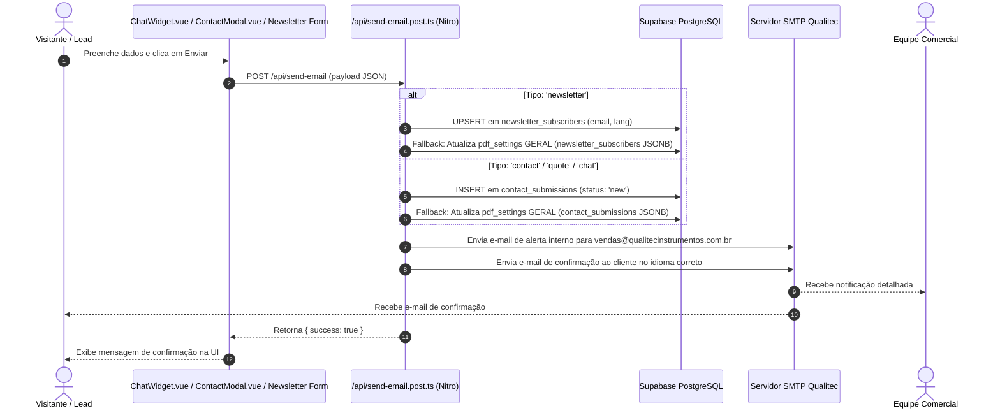

# Arquitetura do Sistema Qualitec 2.0 — Estado Real Atual da Implementação
**Documento Técnico de Diagnóstico e Auditoria Arquitetural**  
**Data da Análise:** 20/08/2026  
**Ambiente:** Nuxt 3 (SSR + Nitro Server Engine) + PostgreSQL (Supabase) + Cloudflare R2 + Nodemailer

---

## 1. Estado Atual do Projeto

### 1.1 Versões de Plataforma e Runtime
* **Framework:** Nuxt `3.11.2` (especificado em `package.json`), resolvido para `3.21.8` em `package-lock.json`.
* **Biblioteca Reativa:** Vue `3.4.21` (especificado em `package.json`), resolvido para `3.5.34` em `package-lock.json`.
* **Roteamento:** `vue-router` `4.3.0` (especificado em `package.json`), resolvido para `4.6.4` em `package-lock.json`.
* **Engine de Servidor Nitro:** `nitropack` `2.13.4` (embutido no ecossistema Nuxt 3).
* **HTTP Server Framework:** `h3` `1.15.11`.
* **Versão do Node.js Esperada:** Node.js `v20.x` (conforme especificado no `Dockerfile` com imagem base `node:20-alpine` e types `@types/node` `20.12.7` / `20.19.43`).
* **Linguagem:** TypeScript utilizado em praticamente todos os arquivos de lógica (`lang="ts"` em `.vue`, arquivos `.ts` em `app/composables/`, `app/server/`, `app/utils/`). JavaScript ES Modules (`.mjs`/`.cjs`) utilizado em scripts de suporte e cron.

### 1.2 Principais Dependências por Categoria
* **UI e Estilização:**
  * `@nuxtjs/tailwindcss` `^6.12.0` (resolvido `6.14.0`)
  * `tailwindcss` `^3.4.19`
  * Google Fonts / Material Symbols Outlined (carregado via CDN em `nuxt.config.ts`)
* **Banco de Dados & SDK Backend:**
  * `@nuxtjs/supabase` `^1.2.2` (resolvido `1.6.2`)
  * `@supabase/supabase-js` `^2.49.1` (dependência transitiva do módulo Supabase)
  * Polyfill WebSocket para servidor: `ws` `8.18.3` em `app/plugins/supabase.ts`
* **Armazenamento em Nuvem / S3:**
  * `@aws-sdk/client-s3` `^3.1077.0` (utilizado no endpoint `app/server/api/upload-r2.post.ts` para comunicação com Cloudflare R2)
* **Geração de Documentos / PDF & QR Code:**
  * `jspdf` `^4.2.1` (resolvido como dependência transitiva do `html2pdf.js`, importado dinamicamente no browser)
  * `html2pdf.js` `^0.14.0`
  * `qrcode` `^1.5.4` e `@types/qrcode` `^1.5.6`
* **Transmissão de E-mails / SMTP:**
  * `nodemailer` `^9.0.3` e `@types/nodemailer` `^8.0.1` (executado exclusivamente no servidor Nitro em `app/server/api/send-email.post.ts`)
* **Segurança e Criptografia:**
  * Algoritmo nativo Node.js `crypto` (`createHmac`, `randomBytes`, `timingSafeEqual`) em `app/server/utils/totp.ts` para 2FA TOTP (RFC 6238).

---

## 2. Estrutura Real do Projeto

O projeto adota a configuração `srcDir: 'app'` em `nuxt.config.ts`. Portanto, todo o código fonte da aplicação reside dentro de `app/`, exceto scripts de manutenção, migrações SQL e arquivos legados.

```
qualitec-catalogo/
├── .agents/                               # Regras de desenvolvimento do agente
├── app/                                   # Diretório raiz da aplicação (srcDir)
│   ├── app.vue                            # Componente raiz do Vue
│   ├── components/                        # 33 Componentes Vue
│   │   ├── AdminCategoryBaseSettings.vue  # Edição de capa, cor, ícone de categoria
│   │   ├── AdminCategoryPdfSettings.vue   # Layout geral de PDF por categoria
│   │   ├── AdminCategoryReplicateModal.vue# Modal de replicação de configs
│   │   ├── AdminCategorySettings.vue      # Orquestrador da aba de categorias
│   │   ├── AdminContactsList.vue          # Tabela e detalhes de contatos/leads
│   │   ├── AdminFileManager.vue           # Gerenciador de uploads R2
│   │   ├── AdminNewsCards.vue             # Editor dos 3 cards da home
│   │   ├── AdminNewsletterSubscribers.vue # Tabela de inscritos na newsletter
│   │   ├── AdminOrderSettings.vue         # Reordenação de categorias e produtos
│   │   ├── AdminPdfCardSettings.vue       # Configuração de cards no PDF
│   │   ├── AdminPdfCoverSettings.vue      # Configuração de capas no PDF
│   │   ├── AdminPdfFontStylesSettings.vue # Tipografia por elemento no PDF
│   │   ├── AdminPdfLayoutSettings.vue     # Margens e slots de produtos no PDF
│   │   ├── AdminPdfLogoSettings.vue       # Dimensões de logos no PDF
│   │   ├── AdminPdfSpecsSettings.vue      # Estilos da tabela de especificações
│   │   ├── AdminPdfTitleSettings.vue      # Tipografia do título no PDF
│   │   ├── AdminProductForm.vue           # Form de cadastro/edição de produtos
│   │   ├── AdminProductSpecsForm.vue      # Sub-form dinâmico de specs
│   │   ├── AdminProductTable.vue          # Tabela de listagem e ações em lote
│   │   ├── AdminSidebar.vue               # Menu lateral administrativo
│   │   ├── AdminSiteSettings.vue          # Personalização visual ampla do site
│   │   ├── AdminTranslations.vue          # Gerenciamento de traduções PT/EN/ES
│   │   ├── AppFooter.vue                  # Rodapé do site
│   │   ├── Button.vue                     # Componente base de botão
│   │   ├── CatalogPdfTemplate.vue         # Template orquestrador de compilação PDF
│   │   ├── CatalogPrintModal.vue          # Modal de download de catálogo
│   │   ├── CatalogSearchToolbar.vue       # Barra de pesquisa e seleção
│   │   ├── ChatWidget.vue                 # Widget flutuante de atendimento/chat
│   │   ├── ContactModal.vue               # Modal de solicitação de orçamento
│   │   ├── ImportErrorModal.vue           # Modal de erros de importação CSV
│   │   ├── Input.vue                      # Componente base de input
│   │   ├── MegaMenu.vue                   # MegaMenu de categorias/famílias
│   │   └── ProductCard.vue                # Card de produto do catálogo
│   ├── composables/                       # 11 Composables Vue/Nuxt
│   │   ├── useAdminCategories.ts          # CRUD de categorias e replicação
│   │   ├── useAdminCategorySettings.ts    # Helpers de edição de categorias
│   │   ├── useAdminProductForm.ts         # Estado do form de produtos
│   │   ├── useAdminProducts.ts            # CRUD de produtos e parser CSV
│   │   ├── useAuth.ts                     # Estado de autenticação client-side
│   │   ├── useCatalog.ts                  # Estado do catálogo público e filtros
│   │   ├── useCategoryColors.ts           # Mapeamento de cores e capas
│   │   ├── usePdfSettings.ts              # Carregamento de configurações de PDF
│   │   ├── useSiteSettings.ts             # Configurações visuais globais da home
│   │   ├── useSupabaseClient.ts           # Wrapper tipado para o cliente Supabase
│   │   └── useTranslations.ts             # Dicionário estático e DB overrides
│   ├── config/                            # Configurações estáticas
│   │   ├── README.md
│   │   └── defaultPdfSettings.ts          # Objeto com ~80 valores padrão de PDF
│   ├── pages/                             # 4 Páginas / Rotas Públicas e Admin
│   │   ├── index.vue                      # Rota `/` (Home institucional e busca)
│   │   ├── catalogo.vue                   # Rota `/catalogo` (Catálogo público)
│   │   ├── nossa-empresa.vue              # Rota `/nossa-empresa` (Institucional)
│   │   └── admin-secreto-x9f2.vue         # Rota `/admin-secreto-x9f2` (Painel)
│   ├── plugins/                           # 1 Plugin Nuxt
│   │   └── supabase.ts                    # Inicialização e polyfill WS
│   ├── public/                            # Arquivos estáticos do app
│   │   ├── favicon.ico
│   │   ├── modelo_importacao.csv
│   │   ├── placeholder.png
│   │   ├── README_IMPORTACAO.md
│   │   ├── robots.txt
│   │   └── fonts/                         # Binários TTF de fontes personalizadas
│   ├── server/                            # Backend Nitro Serverless
│   │   ├── api/
│   │   │   ├── admin/
│   │   │   │   ├── contacts.get.ts        # GET lista consolidada de leads
│   │   │   │   ├── products.ts            # POST/PUT/DELETE de produtos
│   │   │   │   └── subscribers.get.ts     # GET lista de inscritos newsletter
│   │   │   ├── auth/
│   │   │   │   ├── login.post.ts          # POST login + verificação 2FA
│   │   │   │   ├── logout.post.ts         # POST logout e limpeza de cookies
│   │   │   │   ├── refresh.post.ts        # POST renovação de access token
│   │   │   │   ├── register.post.ts       # POST registro de admin
│   │   │   │   ├── session.get.ts         # GET estado da sessão
│   │   │   │   ├── totp/setup.post.ts     # POST configuração TOTP 2FA
│   │   │   │   └── totp.setup.post.ts     # POST (duplicata de setup TOTP)
│   │   │   ├── datasheet.ts               # GET proxy de datasheets em PDF
│   │   │   ├── font.ts                    # GET servidor/validador de fontes TTF
│   │   │   ├── product-image.ts           # GET proxy de imagens de produtos
│   │   │   ├── proxy-image.ts             # GET proxy genérico de imagens
│   │   │   ├── proxy-video.ts             # GET streaming/proxy de vídeos
│   │   │   ├── send-email.post.ts         # POST disparo de SMTP e gravação DB
│   │   │   └── upload-r2.post.ts          # POST upload de mídia para R2
│   │   ├── middleware/
│   │   │   ├── auth.ts                    # Middleware server-side de rotas admin
│   │   │   ├── rate-limit.ts              # Middleware de rate limit em memória
│   │   │   └── security-headers.ts        # Injeção de CSP, HSTS e headers
│   │   ├── plugins/
│   │   │   └── websocket-mock.ts          # Mock de WebSocket para Nitro
│   │   └── utils/
│   │       ├── supabaseAdmin.ts           # Cliente Supabase com Service Role Key
│   │       ├── supabaseClient.ts          # Cliente Supabase com Anon Key
│   │       └── totp.ts                    # Funções criptográficas TOTP RFC 6238
│   └── utils/                             # Utilitários Client-side
│       ├── image.ts                       # Conversão de cores e hex
│       ├── lastPageData.ts                # Dados vetoriais da contracapa (151 KB)
│       ├── pdfBuilder.ts                  # Orquestrador jsPDF
│       ├── pdfDocUtils.ts                 # Utilitários de fontes e layout
│       ├── pdfDrawHelpers.ts              # Desenho de capas, headers e footers
│       ├── pdfImageLoader.ts              # Pré-carregamento de imagens em base64
│       ├── pdfLayoutDrawers.ts            # Layouts 1, 3 e 6 produtos por página
│       └── safeImport.ts                  # Helper de dynamic import
├── middleware/                            # Middleware na raiz (fora de app/)
│   └── auth.ts                            # Guard de rota client-side
├── migrations/                            # 12 Scripts de migração SQL
├── public/                                # Arquivos estáticos na raiz
├── recovery_catalog/                      # 15 Arquivos legados/backup de recuperação
├── scripts/                               # 23 Scripts de manutenção, backup e testes
├── server/                                # Diretório server/ na raiz (fora de app/)
│   └── api/
│       └── font.get.ts                    # Arquivo legado (Nitro usa app/server)
├── supabase/                              # Configuração e migrações CLI do Supabase
│   └── migrations/                        # 32 Migrações SQL
├── Dockerfile                             # Container de build e runtime Node 20
├── docker-compose.yml                     # Orquestração do container
├── deploy.sh                              # Script bash de deploy
├── nuxt.config.ts                         # Configuração Nuxt
└── package.json                           # Dependências e scripts
```

---

## 3. Tamanho e Complexidade dos Arquivos

### 3.1 Tabela de Arquivos Principais do Projeto
A tabela abaixo lista os principais arquivos de código manuscrito do projeto, com foco em densidade, responsabilidades acumuladas e violações ao limite de linhas:

| Arquivo | Linhas | Responsabilidade Principal | Dependências Importantes | Observação Arquitetural |
| :--- | :---: | :--- | :--- | :--- |
| `app/components/AdminSiteSettings.vue` | **3.692** | Configuração visual de todas as seções da Home, Header, Footer e Chat | `useSiteSettings`, `useSupabaseClient`, R2 upload | 🚨 **Super-arquivo (+600 linhas):** Contém formulários massivos, seletores de cor, estilos CSS inline e chamadas diretas ao banco. |
| `app/pages/index.vue` | **973** | Página inicial pública (Hero, Busca, Segmentos, Novidades, Newsletter) | `useSiteSettings`, `useTranslations`, `useCatalog`, `MegaMenu`, `ChatWidget`, `ContactModal` | 🚨 **+600 linhas:** Acumula renderização de vídeo, formulários de busca e newsletter, e lógica de modais. |
| `app/utils/pdfDrawHelpers.ts` | **971** | Renderização vetorial de capas, cabeçalhos, rodapés e badges no jsPDF | `jspdf`, `pdfDocUtils`, `image.ts` | 🚨 **+600 linhas:** Contém rotinas de cálculo geométrico em milímetros para dezenas de elementos visuais do PDF. |
| `app/composables/useAdminCategories.ts` | **873** | CRUD de categorias, renomeação em cascata e replicação de configurações | `useSupabaseClient`, `usePdfSettings`, `useCategoryColors` | 🚨 **+600 linhas:** Concentra lógica de sincronização entre as tabelas `category_assets`, `pdf_settings` e `products`. |
| `app/server/api/send-email.post.ts` | **849** | Validação de leads/newsletter, inserção no banco e envio de e-mails SMTP | `nodemailer`, `@supabase/supabase-js`, `h3` | 🚨 **+600 linhas:** Acumula conexão direta com Supabase, fallback em JSONB, e dezenas de templates HTML de e-mail embutidos. |
| `app/pages/nossa-empresa.vue` | **788** | Página institucional da empresa | `useSiteSettings`, `useTranslations`, `useCatalog`, `MegaMenu` | 🚨 **+600 linhas:** Conteúdo institucional estático com estilos embutidos e vídeo em background. |
| `app/components/AdminCategoryBaseSettings.vue` | **722** | Edição de dados básicos de categoria (cor, nome, imagem, badges) | `useSupabaseClient`, R2 upload | 🚨 **+600 linhas:** UI complexa com múltiplos controles de coordenadas e uploads. |
| `app/composables/useAdminProducts.ts` | **652** | CRUD de produtos, parser e validação de importação CSV | `useSupabaseClient` | 🚨 **+600 linhas:** Acumula parser CSV manual, mapeamento de colunas, conversão de layout_slots e queries. |
| `app/composables/useCatalog.ts` | **605** | Estado do catálogo público, filtros, paginação e orquestração de PDF | `useSupabaseClient`, `useCategoryColors`, `usePdfSettings` | 🚨 **+600 linhas:** Ponto central de acoplamento da área pública. |
| `app/components/AdminOrderSettings.vue` | **565** | Interface de reordenação de categorias e produtos | `useSupabaseClient` | ⚠️ **+400 linhas:** Gestão de estado local e persistência no array `category_order`. |
| `app/components/AdminPdfFontStylesSettings.vue` | **558** | Configuração tipográfica granular por elemento do PDF | `useSupabaseClient` | ⚠️ **+400 linhas:** Interface repetitiva para seleção de fontes, tamanhos e pesos. |
| `app/composables/useSiteSettings.ts` | **550** | Estado reativo e defaults das configurações visuais do site | `useState`, `useSupabaseClient` | ⚠️ **+400 linhas:** Objeto com mais de 100 propriedades reativas com fallback. |
| `app/components/AdminFileManager.vue` | **541** | Gerenciador de arquivos no Cloudflare R2 com histórico | `useSupabaseClient`, `/api/upload-r2` | ⚠️ **+400 linhas:** Upload, listagem em `uploaded_files`, deleção e cópia de URLs. |
| `app/pages/catalogo.vue` | **526** | Página principal do catálogo técnico com busca e grid | `useCatalog`, `useSiteSettings`, `useTranslations`, `ProductCard`, `MegaMenu` | ⚠️ **+400 linhas:** Estrutura de grid, barra de busca expansível e paginação. |
| `app/components/MegaMenu.vue` | **511** | Menu multinível de categorias, famílias e subcategorias | `useTranslations`, `useSiteSettings` | ⚠️ **+400 linhas:** Lógica de hover zone, transições e renderização em 3 níveis. |
| `app/composables/useTranslations.ts` | **502** | Dicionário de traduções PT/EN/ES com fallback e DB overrides | `useState`, `useSupabaseClient` | ⚠️ **+400 linhas:** Dicionário estático extenso + composable `useTranslationsAdmin` para `site_translations`. |
| `app/utils/pdfLayoutDrawers.ts` | **490** | Desenho dos layouts 1, 3 e 6 produtos por página no jsPDF | `pdfDocUtils`, `image.ts` | ⚠️ **+400 linhas:** Cálculos matemáticos de altura de linha, blocos azuis e tabelas de specs. |
| `app/components/CatalogPrintModal.vue` | **469** | Modal de opções de geração e download de catálogo | `useCatalog`, `useCategoryColors`, `useTranslations` | ⚠️ **+400 linhas:** Seleção de capa, orientação, booklet e layout. |
| `app/components/AdminNewsCards.vue` | **423** | Editor dos 3 cards de novidades da home | `useSupabaseClient`, `/api/upload-r2` | ⚠️ **+400 linhas:** Uploads de imagem e PDF, campos PT/EN/ES e upsert em `home_news_cards`. |
| `app/utils/pdfImageLoader.ts` | **422** | Carregador de imagens com conversão para base64 e cache | `image.ts` | ⚠️ **+400 linhas:** Processamento assíncrono de imagens para evitar bloqueio no jsPDF. |
| `app/pages/admin-secreto-x9f2.vue` | **404** | Página raiz do painel administrativo e navegação por abas | `useAdminProducts`, `useAdminCategories`, `useAuth` | ⚠️ **+400 linhas:** Gerencia estado das 9 abas administrativas e modais globais. |
| `app/components/ChatWidget.vue` | **401** | Widget flutuante de chat e formulário pré-chat | `useTranslations`, `/api/send-email` | ⚠️ **+400 linhas:** Componente visual, validação de form e transições de tela. |
| `app/utils/pdfBuilder.ts` | **393** | Orquestrador principal da montagem de documentos jsPDF | `jspdf`, `pdfDrawHelpers`, `pdfLayoutDrawers`, `pdfDocUtils` | ⚠️ **+300 linhas:** Injeção de fontes, paginação e inserção de contracapa. |
| `app/components/CatalogPdfTemplate.vue` | **374** | Disparador e barra de progresso da compilação de PDF | `pdfBuilder`, `useCatalog`, `usePdfSettings` | ⚠️ **+300 linhas:** Watcher de acionamento, feedback visual e modo de publicação. |
| `app/components/AdminContactsList.vue` | **357** | Listagem de leads, busca, detalhes e exportação CSV | `useSupabaseClient`, `/api/admin/contacts` | ⚠️ **+300 linhas:** Tabela de contatos, modal de mensagem e gerador de CSV. |
| `app/utils/pdfDocUtils.ts` | **350** | Utilitários de manipulação de fontes e medição de strings no PDF | `jspdf` | ⚠️ **+300 linhas:** Mapeamento de nomes de fontes e normalização de texto. |
| `app/components/AdminTranslations.vue` | **335** | Interface de edição das chaves de tradução | `useTranslationsAdmin` | ⚠️ **+300 linhas:** Filtros por seção e salvamento em batch em `site_translations`. |
| `app/components/AdminCategoryReplicateModal.vue` | **322** | Modal para replicação seletiva de configurações entre categorias | `useAdminCategories` | ⚠️ **+300 linhas:** Checkboxes de seleção de categorias alvo e grupos de campos. |
| `app/components/AdminPdfCardSettings.vue` | **307** | Configuração visual e dimensional de cards no PDF | `useSupabaseClient` | ⚠️ **+300 linhas:** Controles de padding, offset e raio de borda. |
| `app/components/AdminProductForm.vue` | **296** | Formulário de criação/edição de produtos | `useAdminProductForm`, `AdminProductSpecsForm` | ℹ️ **+200 linhas:** Campos de SKU, URLs, layout e coordenadas. |
| `app/components/AdminCategorySettings.vue` | **244** | Aba de categorias e listagem de sub-configurações de PDF | `useAdminCategories`, sub-componentes AdminPdf* | ℹ️ **+200 linhas:** Gerencia acordeões de cada categoria. |
| `app/components/ProductCard.vue` | **235** | Card de exibição do equipamento no catálogo público | `useTranslations`, `useCategoryColors` | ℹ️ **+200 linhas:** Specs, layout condicional, botões de ação e modal de zoom. |
| `app/components/AdminProductTable.vue` | **233** | Tabela de listagem de produtos com ações e importador | `useTranslations` | ℹ️ **+200 linhas:** Tabela com busca, paginação e botões de exclusão. |
| `app/components/AdminNewsletterSubscribers.vue` | **228** | Tabela de inscritos na newsletter com exportação CSV | `useSupabaseClient`, `/api/admin/subscribers` | ℹ️ **+200 linhas:** Busca por e-mail e download de arquivo CSV. |
| `app/components/AdminCategoryPdfSettings.vue` | **223** | Configuração de orientação e layout geral de categoria | `useSupabaseClient` | ℹ️ **+200 linhas:** Seletores de densidade e orientação. |
| `app/components/ContactModal.vue` | **218** | Modal de orçamento vinculado a produtos | `useTranslations`, `/api/send-email` | ℹ️ **+200 linhas:** Formulário com validação e feedback. |
| `app/utils/lastPageData.ts` | **2 (151 KB)** | Vetorização base64 da contracapa institucional | Nenhuma | ℹ️ **Arquivo de dados estáticos extensos:** Array binário embutido. |

---

## 4. Mapa de Dependências Internas

### 4.1 Principais Módulos Centrais e Seus Consumidores
1. **`useSupabaseClient.ts` (Cliente Frontend):**
   * Consumido por: `useCatalog`, `useAdminProducts`, `useAdminCategories`, `usePdfSettings`, `useCategoryColors`, `useSiteSettings`, `useTranslations`, `AdminFileManager`, `AdminNewsCards`, `AdminOrderSettings`, `AdminSiteSettings`, `AdminContactsList`, `AdminNewsletterSubscribers`.
   * **Impacto:** Ponto de acoplamento total. Qualquer alteração na inicialização ou credenciais impacta 90% do frontend.
2. **`useTranslations.ts` (Internacionalização):**
   * Consumido por: `index.vue`, `catalogo.vue`, `nossa-empresa.vue`, `MegaMenu.vue`, `ProductCard.vue`, `ChatWidget.vue`, `ContactModal.vue`, `CatalogPrintModal.vue`, `AdminProductTable.vue`, `AdminTranslations.vue`.
   * **Impacto:** Altíssimo. Controla reatividade do idioma global e textos de toda a interface pública.
3. **`useCatalog.ts` (Estado do Catálogo e Seleção):**
   * Consumido por: `catalogo.vue`, `index.vue`, `nossa-empresa.vue`, `CatalogPrintModal.vue`, `CatalogPdfTemplate.vue`, `ProductCard.vue`.
   * **Impacto:** Gerencia lista de produtos, seleção múltipla, filtros de busca e acionamento de geração de PDF.
4. **`useCategoryColors.ts` & `usePdfSettings.ts`:**
   * Consumidos por: `useCatalog`, `useAdminCategories`, `CatalogPrintModal.vue`, `CatalogPdfTemplate.vue`, `ProductCard.vue`.
   * **Impacto:** Centralizam o mapeamento de cores hexadecimais e configurações de diagramação do catálogo.
5. **`pdfBuilder.ts` (Motor de PDF):**
   * Consumido por: `CatalogPdfTemplate.vue`.
   * Depende de: `pdfDrawHelpers.ts`, `pdfLayoutDrawers.ts`, `pdfDocUtils.ts`, `pdfImageLoader.ts`, `safeImport.ts`, `/api/font`.
   * **Impacto:** Centraliza a compilação completa do PDF.

### 4.2 Grafo de Relacionamento Real Encontrado no Código

```mermaid
graph TD
    subgraph Paginas ["Páginas (app/pages/)"]
        Index["index.vue"]
        Catalogo["catalogo.vue"]
        About["nossa-empresa.vue"]
        Admin["admin-secreto-x9f2.vue"]
    end

    subgraph Composables ["Composables Centrais (app/composables/)"]
        useCatalog["useCatalog.ts"]
        useTranslations["useTranslations.ts"]
        useSiteSettings["useSiteSettings.ts"]
        useCategoryColors["useCategoryColors.ts"]
        usePdfSettings["usePdfSettings.ts"]
        useAdminProducts["useAdminProducts.ts"]
        useAdminCategories["useAdminCategories.ts"]
        useSupabase["useSupabaseClient.ts"]
    end

    subgraph Componentes ["Componentes Chave (app/components/)"]
        MegaMenu["MegaMenu.vue"]
        ProductCard["ProductCard.vue"]
        ChatWidget["ChatWidget.vue"]
        ContactModal["ContactModal.vue"]
        CatalogPrintModal["CatalogPrintModal.vue"]
        CatalogPdfTemplate["CatalogPdfTemplate.vue"]
        AdminSiteSettings["AdminSiteSettings.vue"]
    end

    subgraph PDFEngine ["Motor de PDF (app/utils/)"]
        pdfBuilder["pdfBuilder.ts"]
        pdfDrawHelpers["pdfDrawHelpers.ts"]
        pdfLayoutDrawers["pdfLayoutDrawers.ts"]
        pdfImageLoader["pdfImageLoader.ts"]
        pdfDocUtils["pdfDocUtils.ts"]
        lastPageData["lastPageData.ts"]
    end

    subgraph Backend ["Backend Nitro (app/server/)"]
        apiSendEmail["api/send-email.post.ts"]
        apiUploadR2["api/upload-r2.post.ts"]
        apiFont["api/font.ts"]
        apiAdminProducts["api/admin/products.ts"]
        apiAdminContacts["api/admin/contacts.get.ts"]
        apiAdminSubscribers["api/admin/subscribers.get.ts"]
        supabaseAdmin["utils/supabaseAdmin.ts"]
    end

    %% Relações Páginas -> Composables & Componentes
    Index --> useTranslations
    Index --> useSiteSettings
    Index --> useCatalog
    Index --> MegaMenu
    Index --> ChatWidget
    Index --> ContactModal

    Catalogo --> useCatalog
    Catalogo --> useTranslations
    Catalogo --> useSiteSettings
    Catalogo --> MegaMenu
    Catalogo --> ProductCard
    Catalogo --> CatalogPrintModal
    Catalogo --> CatalogPdfTemplate

    About --> useTranslations
    About --> useSiteSettings
    About --> useCatalog
    About --> MegaMenu

    Admin --> useAdminProducts
    Admin --> useAdminCategories
    Admin --> AdminSiteSettings

    %% Relações Componentes -> Backend & PDF
    ChatWidget --> apiSendEmail
    ContactModal --> apiSendEmail
    CatalogPrintModal --> useCatalog
    CatalogPdfTemplate --> pdfBuilder
    pdfBuilder --> pdfDrawHelpers
    pdfBuilder --> pdfLayoutDrawers
    pdfBuilder --> pdfImageLoader
    pdfBuilder --> pdfDocUtils
    pdfBuilder --> lastPageData
    pdfBuilder --> apiFont

    %% Acesso a Banco
    useCatalog --> useSupabase
    useAdminProducts --> useSupabase
    useAdminCategories --> useSupabase
    useSiteSettings --> useSupabase
    useTranslations --> useSupabase
    AdminSiteSettings --> useSupabase

    %% Nitro -> Supabase / Storage
    apiAdminProducts --> supabaseAdmin
    apiAdminContacts --> supabaseAdmin
    apiAdminSubscribers --> supabaseAdmin
    apiSendEmail --> supabaseAdmin
```



---

## 5. Arquitetura do Frontend

### 5.1 Estrutura de Páginas e Roteamento
* **`/` (`app/pages/index.vue`):** Home institucional com Hero Banner (vídeo/imagem), busca rápida, segmentos, 3 novidades, newsletter e rodapé.
* **`/catalogo` (`app/pages/catalogo.vue`):** Catálogo técnico com grid de produtos responsivo (4 colunas), busca animada no header e paginação.
* **`/nossa-empresa` (`app/pages/nossa-empresa.vue`):** Conteúdo institucional, história, representadas (HEROSE, Generant, DataOnline) e CTA.
* **`/admin-secreto-x9f2` (`app/pages/admin-secreto-x9f2.vue`):** Painel administrativo dividido em 9 abas de controle.
* **Layouts:** O projeto **não utiliza** diretório `app/layouts/` com múltiplos layouts Nuxt; o layout visual é montado diretamente dentro de cada página (`app/app.vue` atua como casca com `<NuxtPage />`).

### 5.2 Gerenciamento de Estado
* **Estado Global:** Implementado através de `useState` do Nuxt 3 dentro dos composables:
  * `useState('catalog-current-lang')` em `useTranslations.ts` (sincroniza o idioma em todas as páginas e componentes).
  * `useState('site-visual-settings')` em `useSiteSettings.ts` (armazena propriedades visuais da home).
  * `useState('category-assets')` em `useCategoryColors.ts` (cache de cores e capas).
  * `useState('pdf-layout-settings')` em `usePdfSettings.ts` (cache de configurações de PDF).
* **Estado Local:** Gerenciado via `ref` e `reactive` do Vue 3 para controle de modais, inputs de busca, paginação e estados de loading.

### 5.3 Carregamento de Dados (Data Fetching)
* **Padrão Utilizado:** Quase todo o carregamento de dados na aplicação é realizado através de métodos assíncronos manuais invocados no hook `onMounted` ou por eventos do usuário (`loadProducts()`, `fetchAssets()`, `fetchSiteSettings()`, `fetchTranslationsFromDB()`).
* **Ausência de `useAsyncData` / `useFetch` SSR nos dados principais:** Os produtos, configurações visuais e assets de categorias são buscados diretamente no cliente via cliente Supabase (`@supabase/supabase-js`) após a montagem do componente.
* **Componentes Dependentes Exclusivos de Browser:**
  * `CatalogPdfTemplate.vue` e `pdfBuilder.ts`: Utilizam objetos `window`, `document`, `HTMLImageElement` e `DataView`. Dependem de dynamic import (`import('jspdf')` via `safeImport.ts`).
  * `ProductCard.vue` e `catalogo.vue` (modal de zoom): Utilizam eventos de `MouseEvent`, `TouchEvent` e `WheelEvent` para manipulação de coordenadas de tela.

---

## 6. Acesso ao Banco de Dados

### 6.1 Padrões de Acesso Identificados

Existem **dois padrões concorrentes** de acesso ao banco de dados no sistema:

```
PADRÃO 1: ACESSO DIRETO PELO FRONTEND (Majoritário no Admin e Catálogo)
Browser (Vue Component / Composable)
  │
  ├── useSupabaseClient() (Chave Anon Key pública)
  │
  ▼
Supabase REST API (PostgreSQL)


PADRÃO 2: ACESSO VIA API NITRO (Utilizado em E-mails, Auth e parte do Admin)
Browser (Vue Component)
  │
  ├── $fetch('/api/...')
  │
  ▼
Nitro Server Endpoint (app/server/api/)
  │
  ├── supabaseAdmin (Service Role Key privada)
  │
  ▼
Supabase REST API (PostgreSQL)
```

### 6.2 Mapeamento Detalhado por Arquivo e Operação

| Arquivo | Camada | Cliente Supabase | Tabela(s) Alvo | Operações Realizadas |
| :--- | :---: | :---: | :--- | :--- |
| `app/composables/useCatalog.ts` | Frontend | `useSupabaseClient` (Anon) | `products` | `SELECT` |
| `app/composables/useCategoryColors.ts` | Frontend | `useSupabaseClient` (Anon) | `category_assets`, `pdf_settings` | `SELECT` |
| `app/composables/usePdfSettings.ts` | Frontend | `useSupabaseClient` (Anon) | `pdf_settings` | `SELECT` |
| `app/composables/useSiteSettings.ts` | Frontend | `useSupabaseClient` (Anon) | `pdf_settings` | `SELECT`, `UPDATE`, `INSERT` |
| `app/composables/useTranslations.ts` | Frontend | `useSupabaseClient` (Anon) | `site_translations` | `SELECT`, `UPSERT` |
| `app/composables/useAdminProducts.ts` | Frontend | `useSupabaseClient` (Anon) | `products`, `pdf_settings`, `category_assets`, `uploaded_files` | `SELECT`, `INSERT`, `UPDATE`, `DELETE` |
| `app/composables/useAdminCategories.ts` | Frontend | `useSupabaseClient` (Anon) | `category_assets`, `pdf_settings`, `products` | `SELECT`, `INSERT`, `UPDATE`, `DELETE` |
| `app/composables/useAdminCategorySettings.ts`| Frontend | `useSupabaseClient` (Anon) | `categories` *(tabela inexistente)* | `UPDATE` (em `resetToDefaults`) |
| `app/components/AdminFileManager.vue` | Frontend | `useSupabaseClient` (Anon) | `uploaded_files` | `SELECT`, `DELETE` |
| `app/components/AdminNewsCards.vue` | Frontend | `useSupabaseClient` (Anon) | `category_assets`, `home_news_cards` | `SELECT`, `UPSERT` |
| `app/components/AdminNewsletterSubscribers.vue`| Frontend | `useSupabaseClient` (Anon) | `newsletter_subscribers`, `pdf_settings` | `SELECT`, `DELETE` |
| `app/components/AdminContactsList.vue` | Frontend | `useSupabaseClient` (Anon) | `contact_submissions`, `pdf_settings` | `SELECT`, `DELETE` |
| `app/components/AdminOrderSettings.vue` | Frontend | `useSupabaseClient` (Anon) | `category_assets`, `products`, `pdf_settings` | `SELECT`, `UPDATE` |
| `app/server/api/admin/products.ts` | Backend | `supabaseAdmin` (Service Role) | `products` | `INSERT`, `UPDATE`, `DELETE` |
| `app/server/api/admin/contacts.get.ts` | Backend | `supabaseAdmin` / client | `contact_submissions`, `pdf_settings` | `SELECT` |
| `app/server/api/admin/subscribers.get.ts`| Backend | `supabaseAdmin` / client | `newsletter_subscribers`, `pdf_settings`| `SELECT` |
| `app/server/api/send-email.post.ts` | Backend | `createClient` (Service Role) | `newsletter_subscribers`, `contact_submissions`, `pdf_settings` | `INSERT`, `UPSERT`, `UPDATE`, `SELECT` |
| `app/server/api/auth/login.post.ts` | Backend | `supabaseAdmin` (Service Role) | `totp_secrets`, `auth.users` | `SELECT`, `signInWithPassword` |
| `app/server/api/auth/totp/setup.post.ts`| Backend | `supabaseAdmin` (Service Role) | `totp_secrets`, `auth.users` | `UPSERT`, `updateUserById` |
| `app/server/api/datasheet.ts` | Backend | `supabaseAdmin` (Service Role) | `products` | `SELECT` |
| `app/server/api/product-image.ts` | Backend | `supabaseAdmin` (Service Role) | `products` | `SELECT` |
| `daily-number-cron.js` | Cron Script | `supabaseAdmin` (Service Role) | `daily_runs` | `INSERT` |

---

## 7. Modelo de Dados REAL

### 7.1 Levantamento das Tabelas Existentes no Banco

Com base nas migrações em `supabase/migrations/` e `migrations/`, o schema é composto pelas seguintes tabelas:

1. **`products`:**
   * *PK:* `id` (bigint identity).
   * *Colunas:* `title`, `name_code`, `category`, `family`, `subcategory`, `image`, `image_blob` (legado), `datasheet_name`, `datasheet_blob` (legado), `datasheet_url`, `tag`, `tag_color_class`, `bg_class`, `layout_slots`, `specs` (jsonb), `image_scale`, `image_offset_x`, `image_offset_y`, `sort_order`, `card_layout`, `ex_image_url`, `model3d_url`, `created_at`.
   * *FK:* Nenhuma FK estrita (o campo `category` é texto puro vinculado por valor com `category_assets.category`).
2. **`category_assets`:**
   * *PK:* `id` (uuid default `gen_random_uuid()`).
   * *Colunas:* `category` (text unique not null), `cover_image_url`, `cover_image_blob` (legado), `color_hex`, `pdf_url`, `icon_url`, `badge_text`, `badge_icon_url`, `created_at`.
3. **`pdf_settings`:**
   * *PK:* `id` (uuid default `gen_random_uuid()`).
   * *Colunas:* `category` (text unique not null), `orientation`, `layout_settings` (jsonb), `landscape_settings` (jsonb), + cerca de 80 colunas específicas de tipografia, posições e cores.
   * *Observação:* A linha com `category = 'GERAL'` atua como repositório de configurações globais do site, contendo em `layout_settings` o array `category_order` e arrays legados de contatos e inscritos.
4. **`newsletter_subscribers`:**
   * *PK:* `id` (uuid default `gen_random_uuid()`).
   * *Colunas:* `email` (text unique not null), `lang` (varchar(10) default `'pt'`), `created_at` (timestamptz).
   * *Índices:* `idx_newsletter_subscribers_email` (LOWER(email)), `idx_newsletter_subscribers_created_at` (DESC).
5. **`contact_submissions`:**
   * *PK:* `id` (uuid default `gen_random_uuid()`).
   * *Colunas:* `name`, `email`, `phone`, `company`, `subject`, `message`, `product_name`, `type` (varchar(30)), `status` (varchar(20) default `'new'`), `created_at` (timestamptz).
   * *Índices:* `idx_contact_submissions_email` (LOWER(email)), `idx_contact_submissions_created_at` (DESC).
6. **`site_translations`:**
   * *PK Composta:* `(lang_code, key)` (varchar(10), text).
   * *Colunas:* `value` (text), `section` (varchar(50)), `updated_at` (timestamptz).
7. **`home_news_cards`:**
   * *PK:* `id` (integer — valores fixos 1, 2 e 3).
   * *Colunas:* `title_pt`, `title_en`, `title_es`, `image_url`, `link_type`, `link_value`, `link_label_pt`, `link_label_en`, `link_label_es`, `show_link_button`, `updated_at`.
8. **`uploaded_files`:**
   * *PK:* `id` (bigserial).
   * *Colunas:* `filename`, `original_filename`, `file_url`, `file_type`, `file_size`, `uploaded_at`, `uploaded_by`, `description`.
   * *Índices:* `idx_uploaded_files_filename`, `idx_uploaded_files_uploaded_at`.
9. **`totp_secrets`:**
   * *PK:* `user_id` (uuid, referência a `auth.users`).
   * *Colunas:* `secret` (text), `enabled` (boolean), `updated_at` (timestamptz).
10. **`profiles`:**
    * *PK:* `id` (uuid, referência a `auth.users`).
    * *Colunas:* `full_name`, `avatar_url`, `phone`, `bio`, `updated_at`.
11. **`pdf_templates`:**
    * *PK:* `id` (uuid).
    * *Colunas:* `name`, `html_content`, `css_content` (jsonb), `created_at`.
12. **`daily_runs`:**
    * *PK:* `id` (bigint identity).
    * *Colunas:* `numeral` (int default 1), `created_at` (timestamptz).

### 7.2 Análise de Integridade e Inconsistências de Schema
* **Tabela Inexistente Referenciada no Código:**
  * O arquivo `app/composables/useAdminCategorySettings.ts` (linha 166) executa `supabase.from('categories').update(...)` na função `resetToDefaults`. A tabela `categories` **não existe no banco de dados** (o sistema utiliza `category_assets` e `pdf_settings`).
* **Tabelas Órfãs / Pouco Utilizadas:**
  * `pdf_templates`: Criada na migração inicial `000_init_catalog_schema.sql`, mas não possui chamadas de leitura ou escrita no código da aplicação Nuxt (apenas em scripts de backup).
  * `daily_runs`: Utilizada exclusivamente pelo script externo `daily-number-cron.js`.
* **Políticas RLS (Row Level Security):**
  * As tabelas `newsletter_subscribers` e `contact_submissions` possuem RLS estrito: permitem `INSERT` anônimo e `SELECT/DELETE` apenas para `authenticated` e `service_role`.
  * As tabelas `products`, `category_assets` e `pdf_settings` tiveram o RLS desabilitado ou configurado com `FOR ALL USING (true)` pela migração `20260701175717_disable_rls_for_public_tables.sql`, permitindo escrita direta via `anon key` caso o endpoint Supabase seja acessado diretamente.

---

## 8. Autenticação e Autorização

### 8.1 Fluxo Real de Login e Sessão
1. **Solicitação de Login (`app/pages/admin-secreto-x9f2.vue` ou `/login`):**
   * O usuário submete `email`, `password` e `totp` (código de 6 dígitos opcional/obrigatório se ativo) via `POST /api/auth/login`.
2. **Validação no Servidor Nitro (`app/server/api/auth/login.post.ts`):**
   * Utiliza `supabaseAdmin.auth.signInWithPassword({ email, password })`.
   * Se as credenciais forem válidas, consulta `totp_secrets` para verificar se `enabled === true`.
   * Se TOTP estiver ativo:
     * Se o código não for fornecido, retorna `{ totpRequired: true }` sem autenticar.
     * Se o código for fornecido, valida contra o secret Base32 via `verifyTOTP` em `app/server/utils/totp.ts` com tolerância de ±1 período de 30 segundos.
3. **Criação de Cookies HttpOnly:**
   * Em caso de sucesso, seta dois cookies no navegador:
     * `sb-access-token`: Expira em `session.expires_in` (padrão 1h). `HttpOnly=true`, `SameSite=Lax`, `Path=/`.
     * `sb-refresh-token`: Expira em 30 dias. `HttpOnly=true`, `SameSite=Lax`, `Path=/`.
4. **Guards de Rota Client-side (`middleware/auth.ts`):**
   * Intercepta navegações para rotas fora de `['/', '/login']`.
   * Executa `await $fetch('/api/auth/session')`. Se não retornar `user`, redireciona para `/login?redirect=...`.
5. **Middleware de Servidor Nitro (`app/server/middleware/auth.ts`):**
   * Intercepta requisições em `/api/admin/` e `/api/upload-r2`.
   * **Bypass de Exceções:** Rotas `/api/admin/subscribers` e `/api/admin/contacts` são explicitamente liberadas para leitura pública.
   * **Bypass de Ambiente:** Em `process.env.NODE_ENV !== 'production'`, a verificação de autenticação é ignorada.
   * Em produção, extrai o cookie `sb-access-token` e valida via `supabaseAdmin.auth.getUser(accessToken)`. Se inválido, retorna `401 Unauthorized`.
6. **Renovação de Sessão (`app/server/api/auth/refresh.post.ts`):**
   * Lê o cookie `sb-refresh-token` e invoca `supabaseAdmin.auth.refreshSession({ refresh_token })`, reemitindo novos cookies.
7. **Logout (`app/server/api/auth/logout.post.ts`):**
   * Deleta os cookies `sb-access-token` e `sb-refresh-token` setando `maxAge: 0`.

---

## 9. APIs Nitro

Abaixo está o levantamento completo de todos os endpoints presentes no diretório `app/server/api/`:

| Método | Endpoint | Arquivo Fonte | Acesso | Autenticação | Integrações | Responsabilidade |
| :--- | :--- | :--- | :---: | :---: | :---: | :--- |
| `POST` | `/api/auth/login` | `app/server/api/auth/login.post.ts` | Público | Não | Supabase Auth, `totp_secrets` | Valida credenciais e 2FA TOTP, seta cookies de sessão |
| `POST` | `/api/auth/logout` | `app/server/api/auth/logout.post.ts` | Público | Não | Cookies | Limpa cookies de sessão |
| `GET` | `/api/auth/session` | `app/server/api/auth/session.get.ts` | Público | Token via Cookie | Supabase Auth | Valida token do cookie e retorna dados do usuário |
| `POST` | `/api/auth/refresh` | `app/server/api/auth/refresh.post.ts` | Público | Refresh Token | Supabase Auth | Renova o access token a partir do refresh token |
| `POST` | `/api/auth/register` | `app/server/api/auth/register.post.ts` | Restrito | Rate Limited | Supabase Auth Admin | Cria novo usuário administrativo |
| `POST` | `/api/auth/totp/setup` | `app/server/api/auth/totp/setup.post.ts` | Autenticado | Senha no payload | `totp_secrets`, Supabase Auth | Gera segredo TOTP, ativa 2FA e gera QR Code |
| `POST` | `/api/auth/totp.setup` | `app/server/api/auth/totp.setup.post.ts` | Autenticado | Senha no payload | `totp_secrets`, Supabase Auth | **Duplicata legada** do endpoint de setup TOTP |
| `POST` | `/api/admin/products` | `app/server/api/admin/products.ts` | Admin | Auth Middleware | `products` (Service Role) | Insere novo produto no banco |
| `PUT` | `/api/admin/products` | `app/server/api/admin/products.ts` | Admin | Auth Middleware | `products` (Service Role) | Atualiza produto existente por `?id=` |
| `DELETE`| `/api/admin/products` | `app/server/api/admin/products.ts` | Admin | Auth Middleware | `products` (Service Role) | Remove produto por `?id=` ou todos com `?id=all` |
| `GET` | `/api/admin/contacts` | `app/server/api/admin/contacts.get.ts` | Admin | Exceção no Auth Middleware | `contact_submissions`, `pdf_settings` | Consolida e retorna lista de leads/contatos |
| `GET` | `/api/admin/subscribers`| `app/server/api/admin/subscribers.get.ts`| Admin | Exceção no Auth Middleware | `newsletter_subscribers`, `pdf_settings`| Consolida e retorna lista de inscritos |
| `POST` | `/api/upload-r2` | `app/server/api/upload-r2.post.ts` | Admin | Auth Middleware | Cloudflare R2 via S3 SDK | Upload de imagens, PDFs e vídeos para o bucket R2 |
| `POST` | `/api/send-email` | `app/server/api/send-email.post.ts` | Público | Rate Limited | Supabase, SMTP Nodemailer | Grava lead/newsletter e envia e-mails transacionais |
| `GET` | `/api/font` | `app/server/api/font.ts` | Público | Não | File system local (`public/fonts`) | Serve e valida binários de fontes TTF |
| `GET` | `/api/product-image` | `app/server/api/product-image.ts` | Público | Não | `products`, HTTP Cache | Proxy e cache para imagens de produtos |
| `GET` | `/api/proxy-image` | `app/server/api/proxy-image.ts` | Público | Não | HTTP externo, Cache | Proxy genérico para carregar imagens externas no PDF |
| `GET` | `/api/proxy-video` | `app/server/api/proxy-video.ts` | Público | Não | HTTP externo (Wix/CDN) | Proxy e streaming com Range headers para vídeos |
| `GET` | `/api/datasheet` | `app/server/api/datasheet.ts` | Público | Não | `products` | Proxy para entrega de datasheets em PDF |

*Nota sobre endpoints legados fora de `app/`:*
* `server/api/font.get.ts` (na raiz): Existe no repositório, mas como `srcDir` é `app`, o Nitro compila `app/server/api/font.ts`. O arquivo na raiz é um resquício sem execução.

---

## 10. Cloudflare R2

### 10.1 Arquitetura de Armazenamento
O sistema utiliza o Cloudflare R2 como storage de mídia e datasheets, compatível com a API S3 da AWS.

```
Frontend (AdminFileManager / AdminProductForm / AdminNewsCards)
  │
  ├── FormData (file, filename, folder) via POST /api/upload-r2
  │
  ▼
Nitro Server Endpoint (app/server/api/upload-r2.post.ts)
  │
  ├── Valida MIME e Magic Bytes (bloqueia .exe, ELF, scripts)
  ├── Sanitiza nome: {timestamp}_{random6}_{nome-sanitizado}.ext
  ├── S3Client.send(new PutObjectCommand(...))
  │
  ▼
Bucket Cloudflare R2
  │
  ├── Retorna URL pública: https://midia.qualitecinstrumentos.com.br/...
  │
  ▼
Persistência na Tabela `uploaded_files` e no registro do produto (`products.image`/`datasheet_url`)
```

### 10.2 Regras de Validação e Limites
* **Bibliotecas:** `@aws-sdk/client-s3` (`S3Client`, `PutObjectCommand`).
* **Sanitização de Nomes:** Converte para minúsculas, remove acentuação e caracteres especiais, substituindo por `_`.
* **Segurança de Upload:** Bloqueia explicitamente binários executáveis através de magic bytes (`MZ` para `.exe`, `0x7F454C46` para ELF e `#!` para scripts shell).
* **Configuração de Ambiente:** Requer `R2_ACCESS_KEY_ID`, `R2_SECRET_ACCESS_KEY`, `R2_ENDPOINT`, `R2_BUCKET_NAME` e `R2_PUBLIC_URL`.

---

## 11. Sistema de Geração de PDF

### 11.1 Fluxo de Execução do Motor de PDF
A compilação de catálogo em PDF é executada inteiramente no cliente via **jsPDF** para evitar carga de renderização no servidor.

```mermaid
sequenceDiagram
    autonumber
    actor User as Usuário / Admin
    participant Modal as CatalogPrintModal.vue
    participant Template as CatalogPdfTemplate.vue
    participant Builder as pdfBuilder.ts
    participant ImgLoader as pdfImageLoader.ts
    participant Drawers as pdfLayoutDrawers.ts
    participant Helpers as pdfDrawHelpers.ts
    participant FontAPI as /api/font
    participant R2 as /api/upload-r2

    User->>Modal: Configura opções (Capa, Modo, Formato) e clica em Gerar
    Modal->>Template: Ativa flag isGeneratingPdf
    Template->>ImgLoader: Pré-carrega imagens dos produtos em base64 (com cache)
    Template->>Builder: Invoca buildCatalogPdf(opts)
    Builder->>FontAPI: Baixa e registra fontes TTF via addFileToVFS()
    Builder->>Helpers: drawCoverPage() (Capa com logo, imagem e títulos)
    loop Para cada página de produtos
        Builder->>Helpers: drawPageHeader() e drawPageFooter()
        alt layout_slots == 6 (1 produto/pág)
            Builder->>Drawers: drawLayout1()
        alt layout_slots == 1 (6 produtos/pág)
            Builder->>Drawers: drawLayout6()
        else layout_slots == 3 (2 produtos/pág - padrão)
            Builder->>Drawers: drawLayout3()
        end
    end
    Builder->>Builder: Insere Contracapa Institucional (lastPageData.ts)
    alt Modo Download
        Template->>User: Dispara download direto do arquivo .pdf
    else Modo Publicação Oficial (Admin)
        Template->>R2: POST /api/upload-r2 (Blob do PDF)
        Template->>User: Salva URL em category_assets.pdf_url
    end
```

### 11.2 Divisão de Responsabilidades dos Utilitários de PDF
* **`app/utils/pdfBuilder.ts` (393 linhas):** Orquestrador. Calcula dimensões físicas/lógicas, gerencia modo Retrato, Paisagem e Livreto (*Booklet Mode*), registra fontes sob demanda e insere a contracapa.
* **`app/utils/pdfDrawHelpers.ts` (971 linhas):** Desenha a Capa (`drawCoverPage`), cabeçalhos de página com cores dinâmicas (`drawPageHeader`), rodapés com paginação (`drawPageFooter`) e badges.
* **`app/utils/pdfLayoutDrawers.ts` (490 linhas):** Contém os três motores de layout geométrico: `drawLayout1` (1 produto denso), `drawLayout3` (2 produtos padrão) e `drawLayout6` (6 produtos compactos).
* **`app/utils/pdfImageLoader.ts` (422 linhas):** Converte URLs de imagens em base64 via Canvas ou proxy `/api/proxy-image`, mantendo cache em memória (`Map<string, ImageData>`).
* **`app/utils/pdfDocUtils.ts` (350 linhas):** Helper de fontes, dimensões de texto e quebras de linha.
* **`app/utils/lastPageData.ts` (2 linhas / 151 KB):** Dados em string base64 da imagem padrão da contracapa institucional com certificações e marcas representadas.

---

## 12. Internacionalização (i18n)

### 12.1 Mecanismo Real de Tradução
O sistema **não utiliza** `@nuxtjs/i18n`. Ele possui uma infraestrutura própria e customizada baseada em composables reativos e tabelas no banco de dados:

1. **Estado do Idioma Ativo:** `currentLang = useState<LanguageCode>('catalog-current-lang', () => 'pt')`.
2. **Dicionário Estático de Fallback (`app/composables/useTranslations.ts`):** Objeto `defaultTranslations` contendo centenas de chaves para `pt`, `en` e `es`.
3. **Sobrescritas Dinâmicas no Banco (`site_translations`):**
   * O composable `useTranslationsAdmin` carrega via `fetchTranslationsFromDB()` todos os registros de `site_translations` e mescla sobre o dicionário estático (`mergedTranslations`).
4. **Tradução de Categorias (`translateCategoryName` em `useTranslations.ts`):**
   * Utiliza um dicionário estático `categoryDict` combinado com expressões regulares de normalização (remoção de acentos) para mapear termos como `'VÁLVULAS DE SEGURANÇA'` → `'SAFETY VALVES'` / `'VÁLVULAS DE SEGURIDAD'`.
5. **Tradução de E-mails (`app/server/api/send-email.post.ts`):**
   * Contém strings HTML e textos de resposta automática codificados diretamente dentro do handler da API para os 3 idiomas.

---

## 13. E-mails e Leads

### 13.1 Fluxo Real de Envio e Gravação



---

## 14. Segurança

### 14.1 Implementação Objetiva das Camadas de Segurança
* **Autenticação & Sessões:** Cookies `sb-access-token` e `sb-refresh-token` configurados como `HttpOnly`, `SameSite=Lax`, `Path=/` e `Secure` (em produção).
* **2FA TOTP:** Algoritmo HMAC-SHA1 nativo implementado em `app/server/utils/totp.ts` seguindo RFC 6238.
* **Rate Limiting:** Middleware `app/server/middleware/rate-limit.ts` interceptando `/api/auth/login` (5 req / 15 min), `/api/auth/register` (3 req / hora), `/api/upload-r2` (10 req / min), `/api/admin/products` (100 req / min) e `/api/send-email` (10 req / min).
* **Security Headers & CSP (`app/server/middleware/security-headers.ts`):**
  * `X-Frame-Options: DENY`
  * `X-Content-Type-Options: nosniff`
  * `X-XSS-Protection: 1; mode=block`
  * `Strict-Transport-Security: max-age=31536000; includeSubDomains; preload` (produção)
  * `Content-Security-Policy`: Restringe conexões para `'self'`, domínios `*.supabase.co`, `*.r2.dev`, `*.r2.cloudflarestorage.com` e Google Fonts.
* **Isolamento de Credenciais:** `SUPABASE_SERVICE_ROLE_KEY`, credenciais do Cloudflare R2 e senhas SMTP residem apenas nas variáveis de ambiente do servidor Nitro e não são expostas em `public` no `nuxt.config.ts`.

---

## 15. Rate Limiting

### 15.1 Mecanismo e Armazenamento
* **Local de Armazenamento:** Memória RAM local do processo Node.js através de um objeto `Map<string, { count: number; resetAt: number }>()` em `app/server/middleware/rate-limit.ts`.
* **Identificação:** Chave composta por `${ip}:${path}` obtida via `getRequestIP(event, { xForwardedFor: true })`.
* **Limpeza de Memória:** Executada periodicamente a cada 5 minutos via `setInterval`.
* **Comportamento em Produção:**
  * **Em Container Standalone (Docker / VPS):** Opera de forma consistente pois existe um processo único gerenciando a memória.
  * **Em Ambientes Serverless Multi-instância (Vercel / Lambda):** Como cada invocação serverless pode rodar em uma instância isolada, a contagem em memória **não é compartilhada entre nós**, permitindo que limites sejam ultrapassados se requisições caírem em instâncias diferentes (para clusters serverless, a arquitetura exigiria Redis ou banco compartilhado).

---

## 16. Configuração e Runtime

### 16.1 Configuração Nuxt (`nuxt.config.ts`)
* `srcDir: 'app'`
* `compatibilityDate: '2025-07-15'`
* `modules: ['@nuxtjs/tailwindcss']`
* `app.head`: Metatags de viewport, folhas de estilo Google Fonts.
* `runtimeConfig`:
  * Privado (Server): `supabaseServiceRoleKey`, `r2` (accountId, accessKeyId, secretAccessKey, bucketName, endpoint, publicUrl).
  * Público (Client): `public.supabaseUrl`, `public.supabaseAnonKey`.

### 16.2 Variáveis de Ambiente Utilizadas no Código (Apenas Nomes)
* `SUPABASE_URL`
* `SUPABASE_ANON_KEY` / `SUPABASE_KEY` / `NUXT_PUBLIC_SUPABASE_URL` / `NUXT_PUBLIC_SUPABASE_ANON_KEY`
* `SUPABASE_SERVICE_ROLE_KEY` / `SUPABASE_SERVICE_KEY`
* `R2_ACCOUNT_ID`
* `R2_ACCESS_KEY_ID`
* `R2_SECRET_ACCESS_KEY`
* `R2_BUCKET_NAME`
* `R2_ENDPOINT`
* `R2_PUBLIC_URL`
* `SMTP_HOST`
* `SMTP_PORT`
* `SMTP_SECURE`
* `SMTP_USER`
* `SMTP_PASS`
* `RECIPIENT_EMAILS`
* `NODE_ENV`
* `PORT`
* `APP_NAME` / `NEXT_PUBLIC_APP_NAME`

---

## 17. Deploy Atual

### 17.1 Modelo de Hospedagem Identificado
1. **Container Docker (Modelo Principal):**
   * `Dockerfile`: Multi-stage build com `node:20-alpine`, gerando `.output` via `nuxt build` e executando `node .output/server/index.mjs`.
   * `docker-compose.yml`: Expõe porta `3000:3000` com política de reinicialização `restart: always`.
   * `deploy.sh`: Script de atualização automatizada via Git pull, build Docker e restart de container.
2. **Serverless (Compatibilidade):**
   * O código Nitro foi estruturado para ser compatível com plataformas serverless (Vercel, Netlify, Render), embora a memória local de rate limit indique preferência por container contínuo.

---

## 18. Código Duplicado

### 18.1 Análise Estática de Duplicações Encontradas
1. **Gravação Dupla no Banco (Nova Tabela + JSONB Legado):**
   * Em `app/server/api/send-email.post.ts`, `app/server/api/admin/contacts.get.ts` e `app/server/api/admin/subscribers.get.ts`, existem rotinas duplicadas de escrita e leitura que acessam a tabela dedicada (`contact_submissions` / `newsletter_subscribers`) e, em seguida, varrem o JSONB `pdf_settings.layout_settings` para garantir retrocompatibilidade.
2. **Endpoints Duplicados de Setup TOTP:**
   * `app/server/api/auth/totp/setup.post.ts` (96 linhas) e `app/server/api/auth/totp.setup.post.ts` (76 linhas) possuem praticamente a mesma implementação com ligeiras variações de validação de confirmação de e-mail.
3. **Diretório Legado `recovery_catalog/`:**
   * Contém 15 arquivos clonados/reconstruídos (`AdminCategorySettings.vue`, `useCategoryColors.ts`, `admin-secreto-x9f2.vue`, etc.) mantidos na raiz como backup estático.
4. **Inicialização Múltipla de Cliente Supabase no Servidor:**
   * Vários handlers em `app/server/api/` criam novas instâncias via `createClient(supabaseUrl, supabaseKey)` em vez de reutilizar centralizadamente `supabaseAdmin.ts`.
5. **Servidor de Fontes TTF:**
   * `app/server/api/font.ts` e `server/api/font.get.ts` (duplicata na raiz).

---

## 19. Responsabilidades Misturadas

### 19.1 Violações de Separação de Conceitos (SoC)
1. **`app/components/AdminSiteSettings.vue` (3.692 linhas):**
   * Acumula responsabilidades de UI, dezenas de formulários reativos, validações, conversões de dados, manipulação de cores, uploads de imagens para R2 e chamadas diretas de `UPDATE` no Supabase via `useSupabaseClient`.
2. **`app/server/api/send-email.post.ts` (849 linhas):**
   * Acumula parsing HTTP, regras de validação de lead, queries no Supabase com lógica de migração/backfill, templates HTML gigantescos para e-mails em 3 idiomas e comunicação SMTP.
3. **`app/composables/useAdminProducts.ts` (652 linhas):**
   * Funciona simultaneamente como repositório de banco de dados, motor de parsing de arquivos CSV complexos, formatador de dados e gerenciador de estado reativo da interface.
4. **`app/composables/useAdminCategories.ts` (873 linhas):**
   * Executa operações atômicas manuais de renomeação em cascata no banco (atualizando `products`, `category_assets` e `pdf_settings` separadamente no client-side sem transação ACID do banco).

---

## 20. Pontos Centrais / Single Points of Failure (SPOF)

1. **Linha `'GERAL'` na Tabela `pdf_settings`:**
   * Se o registro com `category = 'GERAL'` for deletado ou corrompido, o site perde configurações visuais da home, cabeçalho, rodapé, ordem das categorias e histórico legado.
2. **`app/composables/useCatalog.ts`:**
   * Centraliza todo o fluxo do catálogo público. Falhas neste composable afetam listagem, filtros, busca, MegaMenu e o motor de geração de PDF.
3. **`app/utils/pdfBuilder.ts` e `lastPageData.ts`:**
   * Qualquer quebra nos binários de fontes ou na decodificação do array de 151 KB de `lastPageData.ts` interrompe a geração de PDFs em todo o sistema.

---

## 21. Tratamento de Erros

### 21.1 Padrões por Camada
* **Frontend:** Utiliza blocos `try/catch` envolvendo chamadas assíncronas com exibição de mensagens via componente Toast (`showToast` no painel admin) ou mensagens de feedback em formulários. Erros críticos no console geralmente utilizam `console.error` ou `console.warn` e retornam arrays vazios como fallback.
* **APIs Nitro:** Utiliza `createError` e `sendError` da biblioteca `h3`, retornando códigos de status HTTP semânticos (`400`, `401`, `429`, `500`, `503`) com mensagens amigáveis em JSON.
* **Upload R2 / SMTP:** Trata falhas de rede com blocos `try/catch`, retornando logs no terminal do servidor e mensagens de erro estruturadas para o cliente sem vazar credenciais ou stack traces internas.

---

## 22. Logging e Observabilidade

* **Logs Estruturados:** **Inexistentes.**
* **Serviços de APM / Rastreamento (Sentry, PostHog, Datadog):** **Não configurados.**
* **Mecanismo de Logs Atual:** Utilização de `console.log()`, `console.warn()` e `console.error()` no terminal Node.js e no DevTools do navegador.
* **Logs de Auditoria no Banco:** A tabela `uploaded_files` registra histórico de uploads e a tabela `daily_runs` registra execuções de cron.

---

## 23. Testes

* **Testes Automatizados (Unitários / Integração / E2E):** **Inexistentes no repositório** (não há configuração de Vitest, Jest, Playwright ou Cypress no `package.json`).
* **Scripts Manuais de Verificação (`scripts/`):**
  * `scripts/security-check.ps1` / `scripts/security-check.sh`: Auditoria estática de dependências e permissões.
  * `scripts/test-fonts-api.mjs`: Teste pontual do endpoint `/api/font`.
  * `scripts/test_totp_setup.js`: Teste pontual de criação de segredo 2FA.
* **Gaps de Cobertura:** 100% da aplicação depende atualmente de validação e testes manuais.

---

## 24. Código Morto, Órfão ou Legado

1. **Diretório `recovery_catalog/`:** Contém 15 arquivos de componentes e composables de versões anteriores mantidos desnecessariamente no build/versionamento.
2. **Arquivo `server/api/font.get.ts` (na raiz):** Órfão, pois o Nitro utiliza a pasta `app/server/api/`.
3. **Endpoint `app/server/api/auth/totp.setup.post.ts`:** Duplicata do endpoint `app/server/api/auth/totp/setup.post.ts`.
4. **Tabela `pdf_templates`:** Tabela criada no banco que não possui consumidores no código atual.
5. **Boilerplate com nome `'organizze'`:** Em `app/server/api/auth/totp/setup.post.ts` (linha 70) e `totp.setup.post.ts` (linha 50), o fallback para o issuer do TOTP é `'organizze'`, evidenciando código copiado de outro projeto.
6. **Coluna `model3d_url` em `products`:** Coluna e scripts de upload 3D existentes, porém sem renderizador WebGL/Three.js ativo no frontend.

---

## 25. Diferenças entre o PRD e a Implementação Real

| Item Analisado | O que o PRD descreve | O que o Código Real implementa | Situação Identificada |
| :--- | :--- | :--- | :---: |
| **Versão do Nuxt** | Menciona Nuxt 3 | Nuxt `3.11.2` travado em `3.21.8` no lockfile | `IGUAL` |
| **Arquitetura de Diretórios** | Padrão `app/` como srcDir | `srcDir: 'app'` com resquícios de arquivos em `server/` e `middleware/` na raiz | `IMPLEMENTADO DIFERENTE` |
| **Acesso ao Banco de Dados** | Supabase como repositório central | Acesso misto: Browser acessa direto com `anon key` e Nitro acessa com `service role` | `IMPLEMENTADO DIFERENTE` |
| **Tabela de Categorias** | Documenta `category_assets` e `pdf_settings` | `useAdminCategorySettings.ts` tenta atualizar tabela `categories` que não existe | `PRD DESATUALIZADO` / `BUG NO CÓDIGO` |
| **Persistência de Contatos/Newsletter** | Tabelas dedicadas `contact_submissions` e `newsletter_subscribers` | Grava nas tabelas dedicadas E duplica em JSONB dentro de `pdf_settings.layout_settings` | `IMPLEMENTADO MAS NÃO DOCUMENTADO` |
| **2FA TOTP** | Autenticação em 2 fatores via TOTP | Implementado nativamente em Node crypto sem libs externas, com endpoints duplicados | `IGUAL` |
| **Upload de Mídias** | Cloudflare R2 via S3 SDK | Implementado com proxy de validação de magic bytes e registro em `uploaded_files` | `IGUAL` |
| **Rate Limiting** | Proteção contra abuso | Implementado em memória local do processo Node (`Map`), não distribuído em Redis | `IMPLEMENTADO MAS NÃO DOCUMENTADO` |
| **Visualizador 3D** | Funcionalidade futura | Coluna `model3d_url` e migrações existem, sem componente de visualização na UI | `NÃO IMPLEMENTADO` |
| **Suporte i18n** | Suporte a PT, EN e ES | Implementado via composable próprio + `site_translations` (sem módulo `@nuxtjs/i18n`) | `IGUAL` |
| **Motor de PDF** | jsPDF client-side com 3 densidades e Booklet | Totalmente funcional com injeção de fontes TTF e contracapa institucional | `IGUAL` |

---

## 26. Diagrama Geral da Arquitetura Real

```mermaid
flowchart TD
    subgraph Client ["Navegador do Usuário (Client-Side)"]
        UI_Home["Página Home (index.vue)"]
        UI_Cat["Catálogo (catalogo.vue)"]
        UI_Emp["Nossa Empresa (nossa-empresa.vue)"]
        UI_Adm["Painel Admin (admin-secreto-x9f2.vue)"]
        ChatWidget["ChatWidget.vue"]
        PDF_Engine["Motor jsPDF (pdfBuilder.ts)"]
    end

    subgraph StateLayer ["Camada de Estado Reativo (Composables)"]
        useCatalog["useCatalog.ts"]
        useTranslations["useTranslations.ts"]
        useSiteSettings["useSiteSettings.ts"]
        useAdminCategories["useAdminCategories.ts"]
        useAdminProducts["useAdminProducts.ts"]
    end

    subgraph NitroServer ["Backend Nitro Serverless Engine"]
        MW_RateLimit["Middleware Rate Limit (In-Memory)"]
        MW_Auth["Middleware Auth (Cookie Validation)"]
        MW_Security["Middleware Security Headers & CSP"]
        API_Auth["APIs /api/auth/*"]
        API_Upload["API /api/upload-r2"]
        API_Email["API /api/send-email"]
        API_Admin["APIs /api/admin/*"]
        API_Media["APIs /api/font, /api/product-image, etc."]
    end

    subgraph ExternalServices ["Serviços e Infraestrutura Externa"]
        Supabase_Anon["Supabase REST (Anon Key / RLS)"]
        Supabase_Admin["Supabase REST (Service Role Key)"]
        R2_Storage["Cloudflare R2 Bucket (S3 API)"]
        SMTP_Server["Servidor SMTP (mail.qualitecinstrumentos.com.br)"]
    end

    %% Conexões Client -> Estado
    UI_Home --> StateLayer
    UI_Cat --> useCatalog
    UI_Emp --> StateLayer
    UI_Adm --> useAdminCategories
    UI_Adm --> useAdminProducts

    %% Conexões Diretas Client -> Supabase (Padrão 1)
    StateLayer -- "Consultas e Mutações Diretas (Anon Key)" --> Supabase_Anon
    UI_Adm -- "Mutações Diretas (Anon Key)" --> Supabase_Anon

    %% Conexões Client -> Nitro APIs (Padrão 2)
    ChatWidget -- "POST /api/send-email" --> MW_RateLimit --> API_Email
    UI_Adm -- "POST /api/upload-r2" --> MW_Auth --> API_Upload
    UI_Adm -- "CRUD /api/admin/*" --> MW_Auth --> API_Admin
    PDF_Engine -- "GET /api/font" --> API_Media
    UI_Home -- "POST /api/auth/login" --> MW_RateLimit --> API_Auth

    %% Conexões Nitro -> Serviços Externos
    API_Email -- "Gravação de Leads / Inscrições" --> Supabase_Admin
    API_Email -- "Envio de E-mails (Nodemailer)" --> SMTP_Server
    API_Upload -- "Upload de Objetos (@aws-sdk/client-s3)" --> R2_Storage
    API_Admin -- "Gestão Administrativa Segura" --> Supabase_Admin
    API_Auth -- "Autenticação e 2FA TOTP" --> Supabase_Admin
```



---

## 27. Fluxos Críticos do Sistema

### Fluxo A — Consulta do Catálogo Público
1. O visitante acessa `/catalogo`.
2. O componente monta a estrutura e invoca `loadProducts()` de `useCatalog.ts` e `fetchAssets()` de `useCategoryColors.ts`.
3. O cliente Supabase (`useSupabaseClient`) faz requisição direta para a tabela `products` e `category_assets` usando a `anon key`.
4. Os dados retornados são mapeados na interface, agrupados pelo `MegaMenu.vue` e distribuídos no grid de `ProductCard.vue`.
5. O usuário digita na busca: a filtragem ocorre em memória no cliente através da propriedade computada `filteredProducts`.

### Fluxo B — Solicitação de Orçamento / Lead
1. O usuário clica em "Solicitar Orçamento" no card do produto ou abre o `ChatWidget.vue`.
2. O formulário valida os campos (Nome, E-mail, Telefone, Mensagem).
3. O frontend envia `POST /api/send-email` contendo o payload estruturado.
4. O middleware `rate-limit.ts` valida o limite de requisições por IP.
5. O handler `send-email.post.ts` insere o registro na tabela `contact_submissions` e faz backfill no JSON de `pdf_settings`.
6. O handler aciona o Nodemailer com autenticação SMTP e dispara o e-mail de alerta para a equipe de vendas e a confirmação para o cliente.
7. Retorna `{ success: true }` e a UI transiciona para o estado de confirmação.

### Fluxo C — Alteração Administrativa de Produto
1. O administrador logado acessa a aba "Equipamentos" no `/admin-secreto-x9f2`.
2. Ao editar ou criar produto, os dados são validados pelo composable `useAdminProductForm.ts`.
3. O salvamento pode ocorrer de duas formas:
   * Via cliente Supabase direto no composable `useAdminProducts.ts`.
   * Via endpoint `POST /api/admin/products` ou `PUT /api/admin/products?id=`.
4. A lista reativa de produtos é atualizada e um alerta de Toast é disparado.

### Fluxo D — Upload de Mídia no Cloudflare R2
1. O administrador seleciona um arquivo no `AdminFileManager.vue` ou nos formulários de produto/novidades.
2. O arquivo é envelopado em um `FormData` e submetido via `POST /api/upload-r2`.
3. O middleware `auth.ts` do Nitro valida o token de sessão do cookie.
4. O endpoint sanitiza o nome, verifica magic bytes anti-malware e executa `PutObjectCommand` no bucket R2.
5. A URL pública da CDN é retornada e o upload é registrado na tabela `uploaded_files`.

### Fluxo E — Geração Dinâmica de Catálogo em PDF
1. O usuário seleciona produtos no catálogo e clica em "Baixar Catálogo Técnico".
2. O modal `CatalogPrintModal.vue` permite configurar capa e orientação.
3. Se todos os produtos de uma categoria estiverem selecionados e existir `pdf_url` em `category_assets`, abre diretamente o link do R2 (cache).
4. Caso contrário, aciona `CatalogPdfTemplate.vue`.
5. O componente carrega as imagens via `pdfImageLoader.ts` e invoca `buildCatalogPdf()` em `pdfBuilder.ts`.
6. O jsPDF busca fontes TTF em `/api/font`, desenha a Capa, Headers, Footers, Slots de Produtos (1, 3 ou 6) e insere a contracapa oficial de `lastPageData.ts`.
7. O arquivo `.pdf` é compilado no navegador e entregue via download para o cliente.

---

## 28. Arquivos Mais Importantes para uma Auditoria Posterior

Abaixo estão os **30 arquivos fundamentais** recomendados para priorização em uma auditoria técnica profunda de código e arquitetura:

| Prioridade | Arquivo / Módulo | Motivo da Priorização |
| :--- | :--- | :--- |
| **CRÍTICA** | `app/components/AdminSiteSettings.vue` | **3.692 linhas.** Extrema complexidade, acúmulo de regras de negócio, UI e mutações diretas de banco. |
| **CRÍTICA** | `app/server/api/send-email.post.ts` | **849 linhas.** Centraliza captação de leads, templates de e-mail, conexões com Supabase e SMTP. |
| **CRÍTICA** | `app/composables/useAdminCategories.ts` | **873 linhas.** Executa renomeações em cascata no banco sem transação e gerencia integridade de dados. |
| **CRÍTICA** | `app/composables/useCatalog.ts` | **605 linhas.** Ponto central do catálogo público, filtros, paginação e orquestração de PDF. |
| **CRÍTICA** | `app/composables/useAdminProducts.ts` | **652 linhas.** CRUD de produtos e motor de parser/importação CSV em lote. |
| **CRÍTICA** | `app/server/middleware/auth.ts` | Validação de tokens de sessão, controle de acesso a endpoints administrativos e regras de bypass. |
| **CRÍTICA** | `app/server/middleware/rate-limit.ts` | Implementação de rate limit em memória RAM local e impacto em ambientes de produção. |
| **CRÍTICA** | `app/utils/pdfBuilder.ts` | Orquestrador principal da geração de PDF client-side e injeção dinâmica de fontes. |
| **CRÍTICA** | `app/utils/pdfDrawHelpers.ts` | **971 linhas.** Lógica geométrica e renderização de capas, headers e footers do PDF. |
| **CRÍTICA** | `app/composables/useTranslations.ts` | **502 linhas.** Centraliza internacionalização PT/EN/ES estática e integração com `site_translations`. |
| **ALTA** | `app/server/api/upload-r2.post.ts` | Endpoint de upload, integração Cloudflare R2, sanitização e segurança de arquivos. |
| **ALTA** | `app/server/api/auth/login.post.ts` | Autenticação de usuários, emissão de cookies de sessão e validação 2FA TOTP. |
| **ALTA** | `app/server/utils/totp.ts` | Implementação criptográfica do algoritmo RFC 6238 HMAC-SHA1. |
| **ALTA** | `app/server/middleware/security-headers.ts`| Configuração de Content Security Policy (CSP), HSTS e cabeçalhos defensivos. |
| **ALTA** | `app/pages/index.vue` | **973 linhas.** Página inicial com carregamento de múltiplos módulos, vídeo e formulários. |
| **ALTA** | `app/pages/catalogo.vue` | **526 linhas.** Página de catálogo com busca animada, filtros e grid responsivo. |
| **ALTA** | `app/components/AdminFileManager.vue` | **541 linhas.** Gerenciador de arquivos, manipulação da tabela `uploaded_files` e R2. |
| **ALTA** | `app/components/AdminOrderSettings.vue` | **565 linhas.** Reordenação manual e persistência de sequência no banco. |
| **ALTA** | `app/components/AdminNewsCards.vue` | **423 linhas.** Gestão dos cards dinâmicos da home e integração com `home_news_cards`. |
| **ALTA** | `app/utils/pdfLayoutDrawers.ts` | **490 linhas.** Desenho vetorial dos layouts de 1, 2 e 6 produtos por página. |
| **ALTA** | `app/utils/pdfImageLoader.ts` | **422 linhas.** Conversão de imagens em base64 e gerenciamento de cache em memória. |
| **ALTA** | `app/composables/useSiteSettings.ts` | **550 linhas.** Objeto de estado reativo com dezenas de propriedades visuais da aplicação. |
| **MÉDIA** | `app/pages/admin-secreto-x9f2.vue` | **404 linhas.** Orquestrador das 9 abas do painel administrativo. |
| **MÉDIA** | `app/components/ChatWidget.vue` | **401 linhas.** Widget de atendimento flutuante e formulário de captação de leads. |
| **MÉDIA** | `app/components/MegaMenu.vue` | **511 linhas.** Componente de navegação em 3 níveis. |
| **MÉDIA** | `app/components/CatalogPrintModal.vue` | **469 linhas.** Modal de opções de download e compilação do catálogo. |
| **MÉDIA** | `app/components/CatalogPdfTemplate.vue` | **374 linhas.** Disparador e barra de progresso da geração de PDF. |
| **MÉDIA** | `app/composables/useAdminCategorySettings.ts`| Contém chamada com erro para tabela inexistente `categories`. |
| **MÉDIA** | `app/server/api/admin/contacts.get.ts` | Endpoint de consolidação de contatos com leitura dupla (tabela + JSONB). |
| **MÉDIA** | `app/server/api/admin/subscribers.get.ts`| Endpoint de consolidação de newsletter com leitura dupla (tabela + JSONB). |

---

## 29. Evidências Técnicas e Citações

* **Configuração de `srcDir: 'app'`:** `nuxt.config.ts` (linha 5).
* **Bypass de Autenticação em Desenvolvimento:** `app/server/middleware/auth.ts` (linhas 30-33: `if (process.env.NODE_ENV !== 'production') return`).
* **Chamada para Tabela Inexistente:** `app/composables/useAdminCategorySettings.ts` (linha 166: `supabase.from('categories').update(...)`).
* **Leitura e Gravação Dupla (Nova Tabela + JSONB):** `app/server/api/send-email.post.ts` (linhas 19-56 e 84-135).
* **Armazenamento de Rate Limit em Memória RAM:** `app/server/middleware/rate-limit.ts` (linha 5: `const rateLimitStore = new Map<string, ...>()`).
* **Boilerplate com Issuer `'organizze'`:** `app/server/api/auth/totp/setup.post.ts` (linha 70) e `app/server/api/auth/totp.setup.post.ts` (linha 50).
* **Desativação de RLS em Tabelas Públicas:** `supabase/migrations/20260701175717_disable_rls_for_public_tables.sql` (linhas 1-6).
* **Dados Vetoriais Embutidos em Código:** `app/utils/lastPageData.ts` (linhas 1-2, tamanho: 151 KB).
* **Arquivos Órfãos / Legados na Raiz:** `server/api/font.get.ts`, pasta `recovery_catalog/` (15 arquivos).

---

## 30. Declaração de Conformidade da Análise

* **Nenhum arquivo existente do código, banco de dados, variáveis de ambiente ou dependência foi modificado ou excluído durante esta análise.**
* Todas as informações contidas neste documento refletem **exclusivamente as evidências concretas encontradas no código-fonte, nos arquivos de configuração e nas migrações SQL do repositório**.
