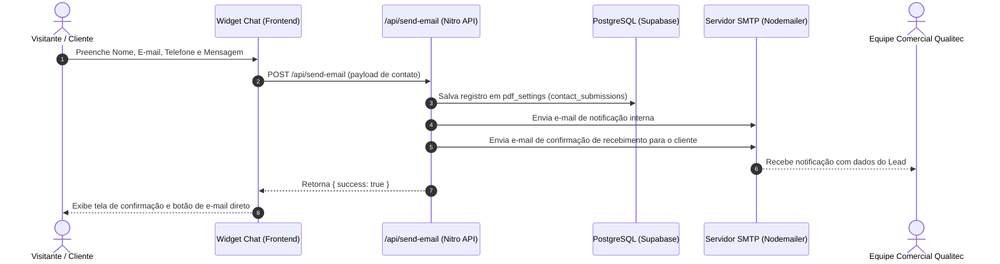

# Documento de Requisitos de Produto (PRD)
## Qualitec 2.0 — Catálogo Técnico & Sistema Comercial/Atendimento

---

## 1. Visão Geral e Objetivos do Produto

### 1.1 Resumo Executivo
O **Qualitec 2.0** é uma plataforma web completa de catálogo técnico digital, geração de orçamentos e atendimento comercial para a **Qualitec C S I M Ltda** (representante exclusiva de marcas globais como HEROSE GmbH, Generant Inc e DataOnline LLC em instrumentação e válvulas para a indústria criogênica, óleo & gás, alimentícia, etc.).

A plataforma combina uma experiência pública responsiva, moderna e rápida para clientes nacionais e internacionais com um ecossistema administrativo poderoso para gestão de produtos, geração automatizada de catálogos em PDF, gerenciamento de inscrições de newsletter e captação/gerenciamento de contatos do chat comercial.

### 1.2 Objetivos Principais
1. **Apresentação Técnica:** Exibir a linha completa de equipamentos industriais de forma categorizada, com fichas técnicas, imagens de alta resolução e especificações detalhadas.
2. **Captação de Leads e Orçamentos:** Capturar solicitações de orçamento e contatos via formulários e widget de chat interativo, registrando os leads diretamente no banco de dados e notificando a equipe por e-mail.
3. **Internacionalização (i18n):** Oferecer suporte nativo dinâmico a 3 idiomas: **Português (PT)**, **Inglês (EN)** e **Espanhol (ES)**.
4. **Customização e Exportação de PDF:** Permitir a geração dinâmica e personalizada de catálogos impressos/PDF com capas customizadas por categoria, ajustes de layout e tipografia.
5. **Autonomia Administrativa:** Disponibilizar um painel administrativo seguro (`/admin-secreto-x9f2`) para gestão de produtos (incluindo importação em massa via planilha), controle de ordem de exibição, uploads de mídias, personalização do site e consulta de leads.

---

## 2. Arquitetura Técnica e Tecnologias

### 2.1 Stack Tecnológico Core
- **Framework Web (Frontend + Serverless API):** [Nuxt 3](https://nuxt.com/) (Vue 3, TypeScript, Nitro Server Engine, SSR).
- **Estilização e UI:** Vanilla CSS responsivo combinado com [Tailwind CSS](https://tailwindcss.com/) e Material Symbols (Google Fonts Icons).
- **Gerenciamento de Estado:** Composables nativos do Nuxt (`useState`, `useNuxtApp`, ref/computed).
- **Camada de Banco de Dados:** PostgreSQL (atualmente servido via Supabase SDK `@supabase/supabase-js`, preparado para migração/PostgreSQL próprio).
- **Armazenamento de Mídias (Storage):** Cloudflare R2 / Amazon S3 Bucket via SDK AWS S3 (`upload-r2.post.ts`).
- **Mecanismo de E-mail (SMTP):** [Nodemailer](https://nodemailer.com/) com suporte a HTML responsivo e respostas automáticas.

### 2.2 Requisitos de Variáveis de Ambiente (`.env`)
```env
# Supabase / PostgreSQL Credentials
SUPABASE_URL="https://xxxxxxxx.supabase.co"
SUPABASE_ANON_KEY="eyJhbGciOiJIUzI1Ni..."
SUPABASE_SERVICE_KEY="eyJhbGciOiJIUzI1Ni..."

# Cloudflare R2 / S3 Storage Credentials
R2_ACCESS_KEY_ID="xxxxxxxxxxxxxxxx"
R2_SECRET_ACCESS_KEY="xxxxxxxxxxxxxxxx"
R2_BUCKET_NAME="qualitec-media"
R2_ENDPOINT="https://xxxxxxxx.r2.cloudflarestorage.com"
R2_PUBLIC_URL="https://midia.qualitecinstrumentos.com.br"

# SMTP Mail Server Credentials
SMTP_HOST="mail.qualitecinstrumentos.com.br"
SMTP_PORT=465
SMTP_SECURE=true
SMTP_USER="vendas@qualitecinstrumentos.com.br"
SMTP_PASS="xxxxxxxx"
RECIPIENT_EMAILS="vendas@qualitecinstrumentos.com.br, engenharia@qualitecinstrumentos.com.br"
```

---

## 3. Especificação das Funcionalidades

### 3.1 Catálogo Público de Equipamentos
- **Busca Global Rápida:** Filtro em tempo real por nome do equipamento, código de modelo (SKU/family), categoria ou especificação técnica.
- **Navegação por Segmentos e Categorias:** Filtros visuais para segmentos industriais (Criogenia, Óleo & Gás, Gases Técnicos, Energia, Açúcar & Álcool, Alimentícia) e categorias (Válvulas de Segurança, Transmissores, Válvulas Globo, etc.).
- **Card do Produto:** Exibição da imagem principal, modelo, categoria traduzida conforme idioma ativo, botão para abrir ficha técnica (PDF) e botão de solicitação de orçamento.
- **Modal de Solicitação de Orçamento (`ContactModal.vue`):** Captura Nome, E-mail, Telefone, Empresa, Assunto e Mensagem com preenchimento automático do nome do produto selecionado.

### 3.2 Widget de Chat Flutuante Interativo (`ChatWidget.vue`)
- **Design de Atendimento:** Botão circular flutuante azul (`#0051ba`) posicionado no canto inferior direito com anel de realce branco e balão de fala interativo (`"Olá! Como posso ajudar?"` ou tradução ativa).
- **Formulário de Captação Pré-Chat:**
  - Apresenta mensagem de boas-vindas: *"Olá! Deixe suas informações de contato para que possamos te contatar mesmo se você não estiver mais no site."*
  - Campos: **Nome Completo***, **E-mail de Contato***, **Telefone de Contato** e **Mensagem/Dúvida***.
  - Validação em tempo real e tratamento de erros/sucesso.
- **Suporte Multilíngue (i18n):** Alterna automaticamente todo o vocabulário para PT, EN ou ES conforme a seleção de idioma do site.
- **Confirmação e Ação:** Após o envio, registra a solicitação no banco de dados, envia notificação SMTP para a equipe de vendas e oferece botão de e-mail direto (`vendas@qualitecinstrumentos.com.br`).

### 3.3 Motor de Geração e Customização de PDF (`CatalogPdfTemplate.vue`)
- **Geração Dinâmica de Catálogos:** Compilação dos produtos selecionados em formato PDF diagramado para impressão.
- **Personalização por Categoria:** Configuração de capa customizada, logo da empresa/representada, fontes, cores primárias, disposição das especificações técnicas e notas de rodapé.

### 3.4 Painel Administrativo (`/admin-secreto-x9f2`)
Acessível via rota administrativa protegida, dividida nas seguintes abas:

1. **Equipamentos (`AdminProductTable.vue` & `AdminProductForm.vue`):**
   - Criação, edição, exclusão e busca de equipamentos.
   - Importador em massa via arquivo Excel/CSV com validação automática de colunas (`category`/`family`, `subfamily`, `sku`/`name_code`).
2. **Categorias & Customização PDF (`AdminCategorySettings.vue` e subcomponentes):**
   - Edição de títulos de capas (PT, EN, ES), imagens de fundo da capa, estilos de fontes, margens e layouts das especificações técnicas.
   - Ferramenta de replicação de configurações entre categorias.
3. **Ajustar Ordens (`AdminOrderSettings.vue`):**
   - Reordenação manual da posição de exibição das categorias e dos produtos no catálogo público.
4. **Upload de Arquivos (`AdminFileManager.vue`):**
   - Gerenciador de mídias para envio direto de imagens e fichas técnicas em PDF para o bucket Cloudflare R2.
5. **Personalizar Site (`AdminSiteSettings.vue`):**
   - Controle total dos textos do rodapé, frase do chat flutuante, ajustes de offset (X/Y), cores, fontes e banners da home.
6. **Traduções (`AdminTranslations.vue`):**
   - Gerenciamento de substituições no banco de dados para nomes de categorias e termos da interface em Inglês e Espanhol.
7. **Novidades (`AdminNewsCards.vue`):**
   - Gestão dos cards de destaques/novidades da página inicial.
8. **Inscritos Newsletter (`AdminNewsletterSubscribers.vue`):**
   - Tabela com lista de e-mails inscritos na newsletter, busca por e-mail/idioma e botão para **Exportar CSV**.
9. **Contatos do Chat / Site (`AdminContactsList.vue`):**
   - Tabela com histórico completo de mensagens recebidas via chat e formulários.
   - Filtros de busca por nome, e-mail, telefone e conteúdo da mensagem.
   - Modal de detalhes da mensagem com botão de resposta direta por e-mail (`mailto:`).
   - Exportação completa dos dados para **CSV**.

---

## 4. Esquema e Modelo de Dados (PostgreSQL)

O banco de dados armazena as informações principais em duas tabelas centrais:

### 4.1 Tabela `products`
Armazena todos os equipamentos do catálogo.

| Coluna | Tipo | Descrição |
| :--- | :--- | :--- |
| `id` | `UUID / BIGINT` | Identificador único do produto |
| `name_code` | `VARCHAR` | Código/Modelo principal (ex: `2401.0000`) |
| `category` | `VARCHAR` | Categoria principal (ex: `VÁLVULAS DE SEGURANÇA`) |
| `subfamily` | `VARCHAR` | Subcategoria ou aplicação |
| `description_pt` | `TEXT` | Descrição técnica em Português |
| `description_en` | `TEXT` | Descrição técnica em Inglês |
| `description_es` | `TEXT` | Descrição técnica em Espanhol |
| `image_url` | `TEXT` | URL da imagem principal do equipamento |
| `pdf_url` | `TEXT` | URL da ficha técnica (datasheet em PDF) |
| `specs` | `JSONB` | Tabela de especificações (Pressão, Temperatura, Diâmetro, Materiais) |
| `display_order` | `INTEGER` | Ordem de exibição relativa na categoria |
| `created_at` | `TIMESTAMPTZ` | Data de criação do registro |

### 4.2 Tabela `pdf_settings`
Armazena configurações globais, customizações visuais e listas de registros em JSONB.

| Coluna | Tipo | Descrição |
| :--- | :--- | :--- |
| `id` | `UUID / BIGINT` | Identificador da configuração |
| `category` | `VARCHAR` | Categoria associada ou `'GERAL'` para configurações globais |
| `cover_title_pt` | `VARCHAR` | Título da capa em Português |
| `cover_title_en` | `VARCHAR` | Título da capa em Inglês |
| `cover_title_es` | `VARCHAR` | Título da capa em Espanhol |
| `layout_settings` | `JSONB` | Contém estilos visuais, além das listas:<br>- `newsletter_subscribers`: array de inscritos<br>- `contact_submissions`: array de contatos do chat/site |
| `updated_at` | `TIMESTAMPTZ` | Última atualização |

---

## 5. Fluxos de Dados e Integrações

### 5.1 Fluxo de Envio de Contato / Lead


---

## 6. Estratégia de Implantação (Deploy & DevOps)

### 6.1 Opções de Hospedagem Suportadas
1. **Container Docker (VPS / Cloud Própria):**
   - Compilação via `npm run build` gerando a pasta de servidor `.output`.
   - Execução do processo servidor com `node .output/server/index.mjs` gerenciado via **PM2** ou **Docker Compose**.
2. **Provedores Serverless (Vercel / Netlify / Render):**
   - Implantação contínua conectada ao repositório Git com detecção automática do framework Nuxt 3.

### 6.2 Checklist para Migração de Banco de Dados (PostgreSQL Interno)
1. Executar o script DDL de criação das tabelas `products` e `pdf_settings` no PostgreSQL da empresa.
2. Migrar os registros existentes do Supabase utilizando o dump SQL ou script de exportação JSON.
3. Atualizar a string de conexão no arquivo `.env` do servidor de produção.

---

## 7. Controle de Histórico e Versão do Documento

| Versão | Data | Autor | Descrição das Alterações |
| :--- | :--- | :--- | :--- |
| **1.0.0** | 05/08/2026 | Equipe de Engenharia / Antigravity | Elaboração inicial do PRD detalhado do sistema Qualitec 2.0. |
