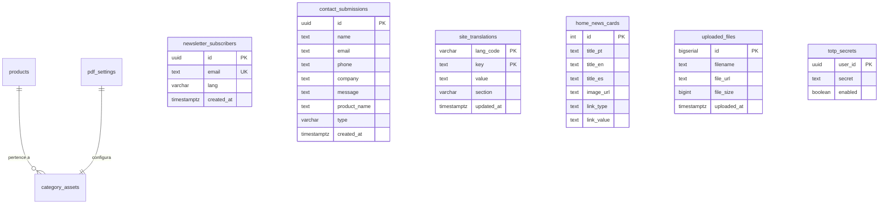
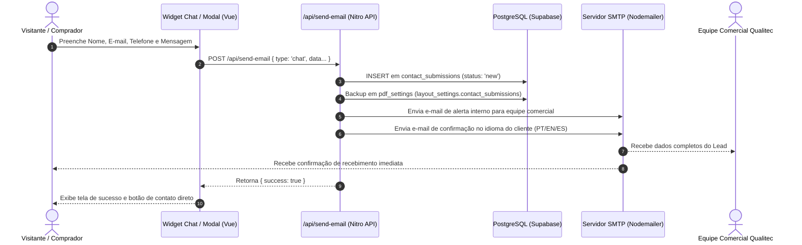
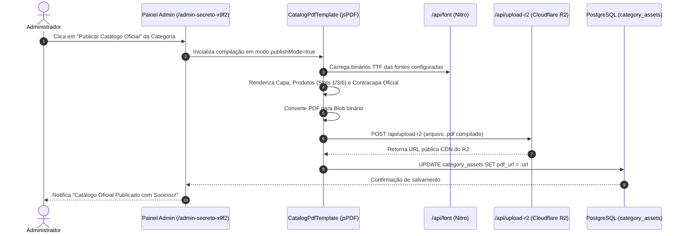

# Documento de Requisitos de Produto (PRD)
## Qualitec 2.0 — Catálogo Técnico Digital, Sistema Comercial & Painel Administrativo

---

## 1. Visão Geral e Objetivos do Produto

### 1.1 Resumo Executivo
O **Qualitec 2.0** é uma plataforma web corporativa completa que unifica catálogo técnico de equipamentos industriais, sistema de captação de leads/orçamentos, motor dinâmico de geração de catálogos em PDF de alta resolução e um ecossistema administrativo integral para a **Qualitec C S I M Ltda**.

A empresa atua como representante e distribuidora exclusiva no Brasil e América Latina de fabricantes globais de ponta no setor de controle de fluidos e instrumentação criogênica:
- **HEROSE GmbH (Alemanha):** Válvulas de segurança, globo, retenção e sistemas para gases industriais e criogenia.
- **Generant Inc (EUA):** Válvulas de alívio, reguladores de pressão, válvulas de esfera e instrumentação de precisão.
- **DataOnline LLC (EUA):** Telemetria avançada, monitoramento remoto de tanques e transmissores de pressão/temperatura para gases liquefeitos.

A plataforma combina uma experiência pública ultra-rápida, responsiva e moderna para clientes nacionais e internacionais com um painel administrativo seguro (`/admin-secreto-x9f2`) para gestão integral de produtos, categorias, mídias em nuvem (Cloudflare R2), configurações de design, internacionalização e gestão de contatos e inscrições.

### 1.2 Objetivos Principais
1. **Apresentação Técnica Precisa:** Exibir a linha completa de equipamentos industriais de forma estruturada em três níveis hierárquicos (Categoria → Família → Subcategoria) com especificações detalhadas, imagens em alta definição e acesso a fichas técnicas em PDF.
2. **Captação Otimizada de Leads e Orçamentos:** Capturar intenções de compra através de formulários modais integrados aos produtos, formulários institucionais e um widget de atendimento flutuante interativo (`ChatWidget.vue`), persistindo os registros em banco de dados e disparando notificações em tempo real via SMTP com confirmação multilíngue para o cliente.
3. **Internacionalização Dinâmica (i18n):** Oferecer suporte nativo a 3 idiomas: **Português (PT)**, **Inglês (EN)** e **Espanhol (ES)**, cobrindo navegação, descrições, termos de catálogo, capas de PDF, e-mails transacionais e sobrescritas gerenciáveis pelo painel administrativo (`site_translations`).
4. **Motor Programático de PDF (jsPDF Engine):** Permitir a compilação instantânea de catálogos em PDF de alta qualidade vetorial no cliente, com capas personalizadas por categoria, suporte a orientação Retrato, Paisagem e formato Livreto (Booklet), injeção sob demanda de fontes TTF e inclusão automática da contracapa institucional padrão (`lastPageData.ts`).
5. **Autonomia e Customização Total no Painel:** Proporcionar controle irrestrito sobre o conteúdo do site (logos, banners em vídeo/imagem, hero cards flutuantes, cores, tipografias, ordem de exibição, notícias, rodapé com 11 frases editáveis, importação em lote via CSV e gerenciador de arquivos R2).

### 1.3 Personas e Atores do Sistema
| Ator / Persona | Descrição | Casos de Uso Principais |
| :--- | :--- | :--- |
| **Visitante / Comprador Industrial** | Engenheiro de processos, comprador de usina, refinaria ou indústria de gases. | Pesquisa por código (SKU) ou segmento, visualização de specs, zoom de imagens, download de PDF/datasheet, solicitação de orçamento. |
| **Cliente Internacional** | Comprador ou integrador da América Latina ou global. | Navegação fluida em EN ou ES, consulta de especificações convertidas e contato comercial direto em seu idioma nativo. |
| **Administrador / Engenheiro de Vendas** | Equipe técnica e comercial interna da Qualitec. | Cadastro/edição de equipamentos, importação em massa via CSV, customização visual do PDF, gerenciamento de mídias R2, consulta de inscritos na newsletter e atendimento aos leads do chat. |
| **Sistema / Robô de Automação** | Processos do servidor Nitro e rotinas cron. | Processamento de uploads, disparo de e-mails de confirmação/notificação, rate limiting e execução de tarefas de manutenção (`daily_runs`). |

---

## 2. Arquitetura Geral do Sistema e Tecnologias

### 2.1 Stack Tecnológico Core
- **Framework Web (Frontend + Backend SSR):** [Nuxt 3](https://nuxt.com/) (Vue 3, TypeScript, Vite, Nitro Server Engine, SSR).
- **Estilização e Design System:** Vanilla CSS responsivo avançado combinado com [Tailwind CSS](https://tailwindcss.com/) e iconografia vetorial via **Material Symbols Outlined** (Google Fonts).
- **Tipografia:** Google Fonts carregadas nativamente: *Inter*, *Hanken Grotesk*, *Rubik*, *Work Sans* e suporte a fontes adicionais no gerador de PDF (*Calibri*, *Verdana*, *Roboto*, etc.).
- **Banco de Dados Relacional:** PostgreSQL servido via [Supabase](https://supabase.com/) com cliente web autenticado (`@supabase/supabase-js`) e cliente administrativo Nitro (`supabaseAdmin.ts` com Service Role Key).
- **Armazenamento de Objetos / CDN (Storage):** [Cloudflare R2](https://www.cloudflare.com/products/r2/) (compatível com S3) gerenciado no backend através do SDK oficial `@aws-sdk/client-s3`.
- **Motor de Geração de Documentos:** [jsPDF](https://github.com/parallax/jsPDF) e [html2pdf.js](https://ekoopmans.github.io/html2pdf.js/) no client-side com decodificação binária de fontes TTF e vetorização gráfica.
- **Motor de Transmissão de E-mails:** [Nodemailer](https://nodemailer.com/) no Nitro Server Engine com templates HTML responsivos em 3 idiomas.
- **Gerador de QR Code:** [node-qrcode](https://github.com/soldair/node-qrcode) para compilação dinâmica de tags e links nos documentos gerados.
- **Segurança e Defesa:** Rate limiter por IP/rota, Content Security Policy (CSP) restritiva, HSTS, cabeçalhos anti-clickjacking (`X-Frame-Options: DENY`), cookies HttpOnly com flags `SameSite=Lax` e `Secure`, e autenticação de dois fatores nativa (2FA TOTP HMAC-SHA1).

### 2.2 Estrutura de Diretórios do Projeto
```
qualitec-catalogo/
├── app/
│   ├── app.vue                           # Componente raiz com montagem global
│   ├── assets/                           # Estilos globais e recursos processados
│   ├── components/                       # Componentes modulares da UI
│   │   ├── AdminCategoryBaseSettings.vue # Configuração de identidade de categorias
│   │   ├── AdminCategoryPdfSettings.vue  # Layout e orientação do PDF
│   │   ├── AdminCategoryReplicateModal.vue # Modal para replicação de configurações
│   │   ├── AdminCategorySettings.vue     # Aba central de categorias e PDF
│   │   ├── AdminContactsList.vue         # Gestão de contatos/leads e exportação CSV
│   │   ├── AdminFileManager.vue          # Gestor de uploads no Cloudflare R2
│   │   ├── AdminNewsCards.vue            # Gestão dos 3 cards de destaque da home
│   │   ├── AdminNewsletterSubscribers.vue# Gestão de inscritos na newsletter
│   │   ├── AdminOrderSettings.vue        # Reordenação de categorias e produtos
│   │   ├── AdminPdfCardSettings.vue      # Estilização granular dos cards no PDF
│   │   ├── AdminPdfCoverSettings.vue     # Tipografia e posicionamento da capa
│   │   ├── AdminPdfFontStylesSettings.vue# Tipografia e pesos por elemento
│   │   ├── AdminPdfLayoutSettings.vue    # Configuração de slots e densidade
│   │   ├── AdminPdfLogoSettings.vue      # Dimensões e posicionamento do logo
│   │   ├── AdminPdfSpecsSettings.vue     # Estilização da tabela de specs no PDF
│   │   ├── AdminPdfTitleSettings.vue     # Tipografia do título de categoria
│   │   ├── AdminProductForm.vue          # Formulário de cadastro/edição de produtos
│   │   ├── AdminProductSpecsForm.vue     # Editor dinâmico de tabela de specs
│   │   ├── AdminProductTable.vue         # Listagem, busca e ações em lote de produtos
│   │   ├── AdminSidebar.vue              # Barra lateral de navegação administrativa
│   │   ├── AdminSiteSettings.vue         # Painel de customização visual do site
│   │   ├── AdminTranslations.vue         # Editor do dicionário de traduções (PT/EN/ES)
│   │   ├── AppFooter.vue                 # Rodapé institucional configurável
│   │   ├── CatalogPdfTemplate.vue        # Componente orquestrador de compilação PDF
│   │   ├── CatalogPrintModal.vue         # Modal de opções de download de catálogo
│   │   ├── CatalogSearchToolbar.vue      # Barra de filtros do catálogo
│   │   ├── ChatWidget.vue                # Widget de chat flutuante e captação de lead
│   │   ├── ContactModal.vue              # Modal de orçamento e contato direto
│   │   ├── ImportErrorModal.vue          # Modal de validação e erros de importação CSV
│   │   ├── MegaMenu.vue                  # Menu multinível de categorias e famílias
│   │   └── ProductCard.vue               # Card de produto com specs e zoom
│   ├── composables/                      # Estado reativo e lógica de negócios
│   │   ├── useAdminCategories.ts         # Operações de CRUD e replicação de categorias
│   │   ├── useAdminCategorySettings.ts   # Estado de configurações por categoria
│   │   ├── useAdminProductForm.ts        # Lógica de validação do form de produtos
│   │   ├── useAdminProducts.ts           # CRUD de produtos, parser CSV e ordenação
│   │   ├── useAuth.ts                    # Estado de sessão e métodos de login/logout
│   │   ├── useCatalog.ts                 # Catálogo público, seleção, paginação e PDF
│   │   ├── useCategoryColors.ts          # Mapeamento de cores de categoria
│   │   ├── usePdfSettings.ts             # Recuperação e mesclagem de configs PDF
│   │   ├── useSiteSettings.ts            # Configurações visuais globais do site
│   │   ├── useSupabaseClient.ts          # Cliente Supabase tipado
│   │   └── useTranslations.ts            # Dicionário e tradução dinâmica PT/EN/ES
│   ├── config/
│   │   └── defaultPdfSettings.ts         # Valores padrão e fallbacks para PDF
│   ├── pages/
│   │   ├── index.vue                     # Página inicial institucional e de busca
│   │   ├── catalogo.vue                  # Página principal do catálogo de produtos
│   │   ├── nossa-empresa.vue             # Página institucional da Qualitec
│   │   └── admin-secreto-x9f2.vue        # Painel administrativo central
│   ├── plugins/
│   │   └── supabase.ts                   # Inicialização de cliente e polyfill WS
│   ├── server/                           # Backend Nitro Serverless
│   │   ├── api/
│   │   │   ├── admin/
│   │   │   │   ├── contacts.get.ts       # Listagem consolidada de contatos/leads
│   │   │   │   ├── products.ts           # Endpoints de escrita de produtos
│   │   │   │   └── subscribers.get.ts    # Listagem de inscritos na newsletter
│   │   │   ├── auth/
│   │   │   │   ├── login.post.ts         # Autenticação com senha e validação TOTP
│   │   │   │   ├── logout.post.ts        # Limpeza de cookies de sessão
│   │   │   │   ├── refresh.post.ts       # Renovação de access token
│   │   │   │   ├── register.post.ts      # Registro seguro de administradores
│   │   │   │   ├── session.get.ts        # Verificação da sessão ativa
│   │   │   │   └── totp/setup.post.ts    # Configuração de chave TOTP 2FA
│   │   │   ├── datasheet.ts              # Proxy e entrega de datasheets
│   │   │   ├── font.ts                   # Servidor de fontes TTF validadas
│   │   │   ├── product-image.ts          # Proxy de imagens de equipamentos
│   │   │   ├── proxy-image.ts            # Proxy seguro para imagens externas
│   │   │   ├── proxy-video.ts            # Proxy para streaming de vídeos
│   │   │   ├── send-email.post.ts        # Disparo de e-mails e gravação atômica
│   │   │   └── upload-r2.post.ts         # Upload de arquivos para o Cloudflare R2
│   │   ├── middleware/
│   │   │   ├── auth.ts                   # Validação de token em rotas protegidas
│   │   │   ├── rate-limit.ts             # Proteção anti-DDoS e brute force
│   │   │   └── security-headers.ts       # Injeção de CSP, HSTS e headers defensivos
│   │   └── utils/
│   │       ├── supabaseAdmin.ts          # Cliente Supabase com Service Role Key
│   │       ├── supabaseClient.ts         # Cliente Supabase público
│   │       └── totp.ts                   # Algoritmo RFC 6238 HMAC-SHA1 nativo
│   └── utils/
│       ├── image.ts                      # Utilitários de manipulação de imagem
│       ├── lastPageData.ts               # Dados vetoriais da contracapa institucional
│       ├── pdfBuilder.ts                 # Orquestrador central de compilação jsPDF
│       ├── pdfDocUtils.ts                # Utilitários de fontes e páginas
│       ├── pdfDrawHelpers.ts             # Renderização de capas, cabeçalhos e rodapés
│       ├── pdfImageLoader.ts             # Carregamento e cache de imagens em base64
│       ├── pdfLayoutDrawers.ts           # Desenho dos layouts (1, 2 e 6 produtos)
│       └── safeImport.ts                 # Import dinâmico seguro para bibliotecas pesadas
├── docs/
│   └── PRD.md                            # Documento de Requisitos de Produto
├── migrations/                           # Migrações SQL e scripts de banco
├── public/                               # Arquivos estáticos servidos diretamente
├── scripts/                              # Utilitários de manutenção, backup e testes
└── nuxt.config.ts                        # Configuração principal do Nuxt
```

### 2.3 Mapeamento das Variáveis de Ambiente (`.env`)
```env
# ==============================================================================
# BANCO DE DADOS & AUTENTICAÇÃO (SUPABASE / POSTGRESQL)
# ==============================================================================
SUPABASE_URL=your_supabase_url
SUPABASE_ANON_KEY=your_anon_key
SUPABASE_SERVICE_ROLE_KEY=your_service_role_key

# ==============================================================================
# STORAGE DE ARQUIVOS (CLOUDFLARE R2 / S3 COMPATIBLE)
# ==============================================================================
R2_ACCOUNT_ID="xxxxxxxxxxxxxxxxxxxxxxxxxxxxxxxx"
R2_ACCESS_KEY_ID="xxxxxxxxxxxxxxxxxxxxxxxxxxxxxxxx"
R2_SECRET_ACCESS_KEY="xxxxxxxxxxxxxxxxxxxxxxxxxxxxxxxxxxxxxxxxxxxxxxxxxxxxxxxxxxxxxxxx"
R2_BUCKET_NAME="qualitec-media"
R2_ENDPOINT="https://xxxxxxxxxxxxxxxx.r2.cloudflarestorage.com"
R2_PUBLIC_URL="https://midia.qualitecinstrumentos.com.br"

# ==============================================================================
# MENSAGERIA & SMTP (NODEMAILER)
# ==============================================================================
SMTP_HOST="mail.qualitecinstrumentos.com.br"
SMTP_PORT=465
SMTP_SECURE=true
SMTP_USER="vendas@qualitecinstrumentos.com.br"
SMTP_PASS="xxxxxxxxxxxxxxxx"
RECIPIENT_EMAILS="vendas@qualitecinstrumentos.com.br, engenharia@qualitecinstrumentos.com.br"
```

---

## 3. Especificação Detalhada dos Módulos Públicos

### 3.1 Cabeçalho Global, Navegação e MegaMenu Dinâmico (`MegaMenu.vue`)
O cabeçalho permanece fixo no topo (*sticky header*) em todas as páginas públicas com as seguintes capacidades:
- **Identidade Visual:** Exibição do logo institucional com dimensões (`header_logo_height`) e posicionamentos (`header_logo_offset_x`, `header_logo_offset_y`) ajustáveis em tempo real pelo painel administrativo.
- **Barra de Navegação:** Links para Home (`/`), Catálogo (`/catalogo`), Nossa Empresa (`/nossa-empresa`) e âncora Contato (`#contato`).
- **Seletor de Idiomas (i18n):** Três botões com bandeiras SVG de alta fidelidade:
  - 🇧🇷 **Português (PT):** Idioma padrão do sistema.
  - 🇬🇧 **Inglês (EN):** Tradução integral de rótulos, categorias, specs e títulos.
  - 🇪🇸 **Espanhol (ES):** Tradução técnica completa.
- **Barra de Pesquisa Animada:** Botão com ícone de lupa que expande um campo de busca rápida com transição suave, permitindo filtrar produtos instantaneamente ou navegar via tecla `Enter`/`Esc`.
- **MegaMenu Multinível:** Barra de categorias horizontais com suporte a *dropdown* expansível. Cada aba exibe um indicador colorido (`category_assets.color_hex`) e ao passar o cursor revela colunas de **Famílias** e listas de **Subcategorias**, permitindo navegação profunda com apenas um clique.

### 3.2 Página Inicial (`/` — `index.vue`)
A página inicial foi projetada para combinar impacto visual, autoridade técnica e conversão de leads:

```
+-----------------------------------------------------------------------------------+
| HEADER GLOBAL: Logo Qualitec | Navegação | Seletor de Idiomas (PT/EN/ES) | Busca  |
+-----------------------------------------------------------------------------------+
| MEGAMENU DE CATEGORIAS: Válvulas de Segurança | Transmissores | Válvulas Globo...  |
+-----------------------------------------------------------------------------------+
| HERO BANNER: Vídeo/Imagem Industrial de Fundo                                     |
| +---------------------------------------------+                                   |
| | Hero Card Flutuante (Frase de Impacto)      |                                   |
| +---------------------------------------------+                                   |
+-----------------------------------------------------------------------------------+
| SEÇÃO BUSCA RÁPIDA: Campo de Pesquisa + 4 Links Diretos Mais Acessados            |
+-----------------------------------------------------------------------------------+
| SEÇÃO PRINCIPAIS SEGMENTOS: Cards Criogenia, Óleo & Gás, Açúcar e Álcool          |
+-----------------------------------------------------------------------------------+
| SEÇÃO NOVIDADES: 3 Cards Dinâmicos com Links para Catálogo / Fichas Técnicas PDF  |
+-----------------------------------------------------------------------------------+
| SEÇÃO NEWSLETTER: Formulário de Inscrição Direta                                  |
+-----------------------------------------------------------------------------------+
| FOOTER INSTITUCIONAL: 11 Frases Editáveis, Endereço, CNPJ, Contatos e Redes Sociais|
+-----------------------------------------------------------------------------------+
```

- **Hero Banner Multimídia:**
  - Suporta plano de fundo em imagem estática de alta definição ou **vídeo em reprodução contínua** (YouTube, Vimeo, arquivos MP4/WebM ou Wix Video Proxy).
  - Possui imagem de fallback imediato para carregamento instantâneo sem travamentos.
- **Hero Card Flutuante Customizável:**
  - Bloco de destaque sobre o banner contendo a frase institucional da empresa.
  - Suporta dois modos de posicionamento: **Preset** (alinhamentos automáticos em grade) ou **Livre** (percentuais exatos de X e Y, extensão até a base, largura máxima, padding e opacidade).
  - Textos configuráveis de forma independente para Português, Inglês e Espanhol.
- **Faixas Divisórias Configuráveis:** Linhas decorativas entre seções com altura e cor customizáveis.
- **Seção de Busca Rápida:**
  - Título e subtítulo com cores e tipografias customizáveis.
  - Campo de entrada com busca global que redireciona para o catálogo.
  - 4 links diretos personalizáveis para termos e categorias de alto tráfego.
- **Seção de Principais Segmentos:**
  - 3 blocos visuais de destaque: *Criogenia & Gases Industriais*, *Óleo & Gás* e *Açúcar e Álcool*.
  - Imagens, alturas de card, opacidades de legenda e links gerenciáveis pelo admin.
- **Seção de Novidades (3 Cards de Destaque):**
  - Três cards com dados provenientes da tabela `home_news_cards`.
  - Cada card possui imagem própria, título nos 3 idiomas e tipo de link flexível:
    - `pdf`: Abre diretamente uma ficha técnica hospedada no R2 em nova aba.
    - `category`: Filtra o catálogo pela categoria associada.
    - `product`: Abre diretamente os detalhes do equipamento.
    - `external`: Redireciona para link externo configurado.
- **Seção de Newsletter:**
  - Campo de captura de e-mail integrado.
  - Validação em tempo real e gravação em tabela dedicada (`newsletter_subscribers`).
  - Disparo imediato de e-mail de agradecimento no idioma do usuário e alerta para a equipe comercial.

### 3.3 Catálogo Técnico de Equipamentos (`/catalogo` — `catalogo.vue`)
O coração operacional do sistema para consulta técnica:
- **Grid Responsivo:** Disposição dos produtos em 4 colunas no desktop com espaçamentos horizontais e verticais ajustáveis (`catalog_grid_gap_x`, `catalog_grid_gap_y`).
- **Cards de Produto (`ProductCard.vue`):**
  - Imagem do equipamento com controle individual de escala e offsets.
  - Código/Modelo principal em destaque (`name_code`).
  - Tag personalizada (ex: "NOVO", "DESTAQUE", "PRONTA ENTREGA") com cores dinâmicas.
  - Categoria traduzida dinamicamente conforme o idioma ativo.
  - Tabela de especificações resumidas (Pressão, Temperatura, Conexões, Materiais) com estilos de linha e tipografia padronizados.
  - Botão **"Ficha de Especificação" / "Ver Documentação"**: Abre o datasheet técnico em PDF ou o modal do produto.
  - Botão **"Solicitar Orçamento"**: Dispara o modal de cotação com o equipamento pré-selecionado.
- **Modal de Zoom e Pan de Alta Precisão:**
  - Ao clicar na imagem do produto, abre-se uma tela cheia interativa.
  - Suporte completo a *Drag & Drop* com mouse no desktop e gestos de toque no mobile.
  - Controle de zoom de **50% a 400%**, atalho na roda do mouse (*wheel*) e botão de reset.
- **Sistema de Seleção Múltipla e Download:**
  - Checkbox de seleção individual por card.
  - Botões "Selecionar Todos" e "Limpar Seleção".
  - Contador de itens selecionados em tempo real nos botões de download.
- **Modal de Download de Catálogo (`CatalogPrintModal.vue`):**
  - Permite escolher o tipo de capa:
    - **Dinâmica (Automática):** Se todos os produtos selecionados pertencerem à mesma categoria, utiliza a capa oficial da categoria; caso contrário, utiliza a Capa Geral.
    - **Capa Geral:** Força a capa institucional corporativa da Qualitec.
    - **Capa Específica:** Permite selecionar explicitamente qualquer categoria do catálogo.
  - Opção de formato: **Padrão (A4)**, **Apresentação (Modo Paisagem)** ou **Livreto (Booklet)**.

### 3.4 Página Institucional Nossa Empresa (`/nossa-empresa` — `nossa-empresa.vue`)
Página corporativa com narrativa completa sobre a Qualitec:
- **Hero Institucional:** Banner de grande formato com overlay translúcido e frases de compromisso com a engenharia nacional.
- **Histórico & Quem Somos:** Apresentação da infraestrutura, laboratório de calibração, estoque de peças e equipe de engenharia especializada.
- **Métricas e Estatísticas:** Números de destaque (anos de atuação, clientes industriais atendidos, equipamentos fornecidos).
- **Representadas Oficiais:** Apresentação detalhada das marcas HEROSE, Generant e DataOnline com logotipos e competências de cada fabricante.
- **Segmentos Industriais:** Descrições técnicas da atuação em Criogenia, Gases do Ar (LIN, LOX, LAR), GNL (Gás Natural Liquefeito), Hidrogênio, Óleo & Gás, Sucroalcooleiro e Indústria Alimentícia.
- **CTA Comercial:** Botões para solicitação de cotação imediata ou agendamento com especialista técnico.

### 3.5 Widget de Atendimento / Chat Flutuante (`ChatWidget.vue`)
- **Posicionamento & Animação:** Botão circular flutuante fixado no canto inferior direito (`#004A96`), com anel de realce pulsante e balão de fala interativo traduzido automaticamente conforme o idioma do site.
- **Formulário Pré-Chat:**
  - Mensagem de acolhimento inicial.
  - Campos: **Nome Completo***, **E-mail Corporativo***, **Telefone com DDD/DDI** e **Mensagem/Dúvida Técnica***.
  - Validação estrita de formato de e-mail e campos obrigatórios.
- **Processamento:**
  - Ao submeter, persiste o contato na tabela `contact_submissions`.
  - Dispara requisição autenticada para `/api/send-email`.
  - Transiciona a interface para estado de confirmação com atalho para envio de e-mail direto.

### 3.6 Modal de Contato e Orçamento (`ContactModal.vue`)
- Modal invocado a partir dos cards de produto ou links do site.
- Preenche automaticamente o campo `product_name` quando acionado a partir de um equipamento específico.
- Captura os dados de contato do cliente e encaminha com prioridade para a equipe de engenharia comercial.

---

## 4. Especificação do Painel Administrativo (`/admin-secreto-x9f2`)

O acesso ao painel é centralizado na rota restrita `/admin-secreto-x9f2`, estruturado em **9 abas operacionais**:

```
+----------------------------------------------------------------------------------------------------+
| PAINEL ADMINISTRATIVO QUALITEC                                [ Gerar / Baixar PDF ] [ Ver Catálogo ]|
+----------------------------------------------------------------------------------------------------+
| [ Equipamentos ] [ Categorias & PDF ] [ Ordens ] [ Arquivos ] [ Site ] [ Traduções ] [ Novidades ] |
| [ Inscritos Newsletter ] [ Contatos do Chat ]                                                      |
+----------------------------------------------------------------------------------------------------+
```

### 4.1 Aba 1: Equipamentos (`AdminProductTable.vue` & `AdminProductForm.vue`)
- **Tabela Geral de Produtos:**
  - Exibição de imagem, código (`name_code`), título, categoria, subfamília, tag e quantidade de specs.
  - Campo de busca instantânea e paginação.
  - Ações por linha: **Editar** (abre modal com todos os dados preenchidos) e **Excluir**.
  - Ações em lote: **Excluir Selecionados**, **Excluir Todos** e **Converter Títulos/Categorias para MAIÚSCULAS**.
- **Formulário de Cadastro e Edição:**
  - Título do equipamento, código de modelo (SKU), seleção de categoria (com lista dinâmica), subcategoria e família.
  - URL da imagem principal (com atalho para upload R2) e URL da ficha técnica (datasheet PDF).
  - Escala da imagem no PDF (`image_scale`) e deslocamentos (`image_offset_x`, `image_offset_y`).
  - Seletor de layout de slots (1 = 6 produtos/pág; 3 = 2 produtos/pág; 6 = 1 produto/pág).
  - Editor dinâmico de especificações técnicas (`AdminProductSpecsForm.vue`): adição, remoção e reordenação de pares *Rótulo : Valor*.
- **Importador em Massa via CSV:**
  - Parser robusto com suporte a delimitadores `;` e `,`, tratamento de quebras de linha e campos entre aspas.
  - Mapeamento inteligente de colunas: `title`, `name_code`, `category`, `subfamily`, `tag`, `layout_slots`, `image_url`, `datasheet_url`, `specs`, `ex_image_url`.
  - Colunas adicionais no CSV são convertidas automaticamente em especificações técnicas.
  - Modal de validação preventiva (`ImportErrorModal.vue`) que detecta inconsistências de categorias antes de gravar.

### 4.2 Aba 2: Categorias & Customização Granular de PDF (`AdminCategorySettings.vue`)
Gerenciador visual completo da identidade do catálogo impresso/digital com mais de 100 parâmetros:
- **Gestão de Categorias (`AdminCategoryBaseSettings.vue`):**
  - Criação, renomeação e exclusão de categorias.
  - Ao renomear uma categoria, todos os produtos vinculados têm sua categoria atualizada em cascata.
  - Configuração de cor primária em hexadecimal (`color_hex`), ícone (`icon_url`), imagem de capa (`cover_image_url`) e badge personalizado.
- **Configurações Granulares de PDF:**
  - `AdminPdfCoverSettings.vue`: Títulos da capa em PT, EN e ES, subtítulos, fontes, tamanhos e posições.
  - `AdminPdfLayoutSettings.vue`: Orientação padrão (Retrato/Paisagem), margens e densidade de produtos.
  - `AdminPdfCardSettings.vue`: Dimensões dos cards, offsets X/Y, arredondamentos e cores de fundo.
  - `AdminPdfSpecsSettings.vue`: Largura de colunas, espaçamentos, estilos de separador (tracejado/sólido/zebrado) e cores das especificações.
  - `AdminPdfTitleSettings.vue` & `AdminPdfFontStylesSettings.vue`: Tipografias individuais, pesos (negrito/itálico/sublinhado) e tamanhos para cada texto do documento.
  - `AdminPdfLogoSettings.vue`: Posição, largura e altura do logo nas páginas internas.
- **Replicação de Configurações (`AdminCategoryReplicateModal.vue`):**
  - Permite copiar o estilo de uma categoria modelo para várias categorias selecionadas, escolhendo quais grupos de propriedades replicar (Capa, Layout, Tipografia, Specs).
- **Publicação de Catálogo Oficial:**
  - Compila o PDF de uma categoria inteira e faz o upload automático para o Cloudflare R2, salvando a URL em `category_assets.pdf_url` para servir como cache instantâneo aos usuários públicos.

### 4.3 Aba 3: Ajustar Ordens (`AdminOrderSettings.vue`)
- Interface visual para reordenar a sequência de exibição das categorias no catálogo público e no MegaMenu.
- Reordenação manual dos produtos dentro de cada categoria.
- Gravação da sequência no array `layout_settings.category_order` da categoria `GERAL`.

### 4.4 Aba 4: Upload de Arquivos (`AdminFileManager.vue`)
- Gerenciador de mídias integrado ao bucket Cloudflare R2.
- Upload de imagens (PNG, JPG, WebP, SVG), datasheets (PDF) e vídeos (MP4, WebM).
- Sanitização automática de nomes de arquivo e geração de hashes anti-colisão.
- Histórico de uploads persistido na tabela `uploaded_files` com data, tamanho, tipo e autor.
- Ações rápidas: copiar URL pública com um clique, pré-visualizar mídia e excluir arquivo.

### 4.5 Aba 5: Personalizar Site (`AdminSiteSettings.vue`)
Controle total dos elementos gráficos e de texto da interface pública:
- **Cabeçalho:** URL do logo, altura em pixels e offsets X/Y.
- **MegaMenu:** Cores de fundo, alturas, níveis de desfoque (*backdrop-blur*), opacidade do overlay e tipografia de abas, famílias e subcategorias.
- **Hero Banner:** Tipo de fundo (imagem ou vídeo), URLs de mídia, posicionamento do card, opacidade, raio de borda e textos nos 3 idiomas.
- **Seção de Busca e Segmentos:** Cores de fundo, paddings, cores de texto, links rápidos e imagens dos cards de segmentos.
- **Seção de Novidades e Newsletter:** Dimensões de cards, cores de botões e textos institucionais.
- **Rodapé:** Cores de fundo e borda, além de controle tipográfico e posicional das **11 frases institucionais independentes**.
- **Chat Flutuante:** Cores, frases de boas-vindas e configurações de atendimento.
- **Catálogo:** Espaçamento horizontal e vertical do grid (`catalog_grid_gap_x`, `catalog_grid_gap_y`).

### 4.6 Aba 6: Dicionário de Traduções (`AdminTranslations.vue`)
- Gerenciamento de todos os termos da interface pública em Português, Inglês e Espanhol.
- Categorização por seções: Navegação, Catálogo, Segmentos, Home, Nossa Empresa e Rodapé.
- Gravação e leitura diretamente na tabela `site_translations` com fallback para o código TypeScript local (`useTranslations.ts`).

### 4.7 Aba 7: Cards de Novidades (`AdminNewsCards.vue`)
- Editor dos 3 cards de novidades da página inicial.
- Controle individual por card: imagem com upload R2, títulos em PT/EN/ES, tipo de link (PDF, Categoria, Produto, Externo) e exibição do botão de ação.
- Persistência na tabela `home_news_cards`.

### 4.8 Aba 8: Inscritos na Newsletter (`AdminNewsletterSubscribers.vue`)
- Tabela com lista completa de assinantes capturados pelo site.
- Informações: Endereço de e-mail, idioma de inscrição (PT, EN, ES) e data/hora do cadastro.
- Filtro de busca em tempo real por e-mail e ordenação decrescente.
- Botão para **Exportar Lista para CSV**.

### 4.9 Aba 9: Contatos do Chat e Formulários (`AdminContactsList.vue`)
- Histórico completo de leads e mensagens recebidas através do widget de chat e do modal de contato.
- Informações: Nome do lead, e-mail, telefone, empresa, assunto, mensagem completa, nome do produto de interesse, tipo de contato e data de envio.
- Filtros por termo de busca, tipo de solicitação e período.
- **Modal de Detalhes do Lead:** Visualização estruturada da mensagem com botão de resposta direta via cliente de e-mail padrão (`mailto:`).
- Botão para **Exportação Completa para CSV**.

---

## 5. Motor de Geração de Catálogos em PDF (jsPDF Engine)

### 5.1 Arquitetura da Compilação
A geração de catálogos opera 100% no cliente através de rotinas otimizadas em `app/utils/`:

```
CatalogPdfTemplate.vue (Disparador / UI de Progresso)
       │
       ▼
pdfBuilder.ts (Orquestrador de Documento jsPDF)
 ├── pdfImageLoader.ts    --> Converte imagens para base64 com cache em memória
 ├── pdfDocUtils.ts       --> Normaliza fontes e calcula alturas de texto
 ├── /api/font?name=...   --> Baixa e valida binários TTF sob demanda (addFileToVFS)
 ├── pdfDrawHelpers.ts    --> Desenha Capa, Cabeçalho e Rodapé por página
 ├── pdfLayoutDrawers.ts  --> Renderiza Layout 1 (1 pág), Layout 3 (2 pág) e Layout 6 (6 pág)
 └── lastPageData.ts      --> Insere Contracapa Institucional Oficial Qualitec
```

### 5.2 Densidades de Layout Suportadas
| Identificador no Banco (`layout_slots`) | Produtos por Página | Função Renderizadora | Aplicação Típica |
| :---: | :---: | :---: | :--- |
| **6** | **1 Equipamento** | `drawLayout1` | Válvulas complexas e sistemas com fichas técnicas extensas e tabelas densas. |
| **3 (Padrão)** | **2 Equipamentos** | `drawLayout3` | Padrão corporativo da Qualitec (foto, código, descrição e tabela de especificações). |
| **1** | **6 Equipamentos** | `drawLayout6` | Visão compacta tipo lista de referência rápida e catálogos sumários. |

### 5.3 Modos de Orientação e Formato
1. **Retrato (Portrait A4 — 210 × 297 mm):** Formato padrão para impressão e leitura técnica em folha A4.
2. **Apresentação / Paisagem (Landscape A4 — 297 × 210 mm):** Formato panorâmico ideal para apresentações em tela e projeções.
3. **Modo Livreto (Booklet):** Cria páginas em A4 paisagem com 2 páginas lógicas A4 retrato posicionadas lado a lado em escala, prontas para encadernação em livreto.

### 5.4 Gerenciamento e Injeção Dinâmica de Fontes TTF
- Fontes são baixadas sob demanda a partir do endpoint `/api/font?name=<arquivo.ttf>`.
- O sistema valida os *magic bytes* do binário (TrueType/OpenType) para evitar arquivos corrompidos.
- Fontes registradas no VFS do jsPDF: *Inter*, *Verdana*, *Roboto*, *Calibri*, *Hanken Grotesk*, *Outfit*, etc.

### 5.5 Cache Inteligente de Catálogos Publicados
- Quando um usuário solicita o download de uma categoria completa e essa categoria possui um PDF oficial publicado (`category_assets.pdf_url`), o sistema abre diretamente o link do Cloudflare R2 em nova aba, economizando tempo de processamento e banda de rede.

---

## 6. Modelo de Dados e Esquema Relacional (PostgreSQL)

O banco de dados do Qualitec 2.0 é composto por **12 tabelas especializadas**:



### 6.1 Tabela `products`
Armazena todos os equipamentos industriais do catálogo.

| Coluna | Tipo | Nulo | Descrição |
| :--- | :--- | :---: | :--- |
| `id` | `BIGINT (IDENTITY)` | Não | Chave primária auto-incrementável |
| `title` | `TEXT` | Não | Nome comercial completo do equipamento |
| `name_code` | `TEXT` | Não | Código de modelo ou SKU (ex: `TRANS-15554`, `06380.0000`) |
| `category` | `TEXT` | Não | Categoria em maiúsculas (ex: `VÁLVULAS DE SEGURANÇA`) |
| `family` | `TEXT` | Sim | Família do produto para organização no MegaMenu |
| `subcategory` | `TEXT` | Sim | Subcategoria específica do equipamento |
| `image` | `TEXT` | Sim | URL pública da imagem principal no Cloudflare R2 |
| `datasheet_name` | `TEXT` | Sim | Nome de exibição do arquivo de datasheet |
| `datasheet_url` | `TEXT` | Sim | URL pública do datasheet em PDF |
| `tag` | `TEXT` | Sim | Rótulo de status (padrão: `'NOVO'`) |
| `tag_color_class` | `TEXT` | Sim | Classe CSS ou cor hexadecimal da tag |
| `bg_class` | `TEXT` | Sim | Classe CSS do fundo do card |
| `layout_slots` | `INTEGER` | Sim | Densidade no PDF: `1` (6/pág), `3` (2/pág), `6` (1/pág) |
| `specs` | `JSONB` | Sim | Array de especificações técnicas `[{"label": "Pressão", "value": "0 a 40 bar"}]` |
| `image_scale` | `NUMERIC` | Sim | Fator de escala da imagem no PDF (padrão: `1.0`) |
| `image_offset_x` | `NUMERIC` | Sim | Deslocamento horizontal da imagem no PDF |
| `image_offset_y` | `NUMERIC` | Sim | Deslocamento vertical da imagem no PDF |
| `ex_image_url` | `TEXT` | Sim | URL de imagem auxiliar ou vista explodida |
| `sort_order` | `INTEGER` | Sim | Ordem de exibição manual na listagem |
| `card_layout` | `TEXT` | Sim | Override de layout específico do card |
| `model3d_url` | `TEXT` | Sim | URL de modelo tridimensional (quando disponível) |
| `created_at` | `TIMESTAMPTZ` | Não | Data de criação do registro |

### 6.2 Tabela `category_assets`
Define as categorias e seus ativos visuais no site e no PDF.

| Coluna | Tipo | Nulo | Descrição |
| :--- | :--- | :---: | :--- |
| `id` | `UUID` | Não | Chave primária (`gen_random_uuid()`) |
| `category` | `TEXT` | Não | Nome da categoria (ÚNICO) |
| `cover_image_url` | `TEXT` | Sim | URL da imagem de fundo da capa no R2 |
| `color_hex` | `TEXT` | Sim | Cor primária da categoria (padrão: `'#005db7'`) |
| `pdf_url` | `TEXT` | Sim | URL do catálogo oficial compilado e publicado no R2 |
| `icon_url` | `TEXT` | Sim | URL do ícone da categoria para menu e cabeçalhos |
| `badge_text` | `TEXT` | Sim | Texto do selo/badge da capa |
| `badge_icon_url` | `TEXT` | Sim | URL do ícone do badge da capa |
| `created_at` | `TIMESTAMPTZ` | Não | Data de criação |

### 6.3 Tabela `pdf_settings`
Contém todas as configurações visuais, tipográficas e dimensionais do PDF por categoria (e a categoria especial `'GERAL'`).

| Coluna | Tipo | Nulo | Descrição |
| :--- | :--- | :---: | :--- |
| `id` | `UUID` | Não | Chave primária |
| `category` | `TEXT` | Não | Nome da categoria associada ou `'GERAL'` |
| `orientation` | `TEXT` | Sim | Orientação padrão (`'portrait'` ou `'landscape'`) |
| `layout_settings` | `JSONB` | Sim | Configurações avançadas e arrays de layout |
| `landscape_settings`| `JSONB` | Sim | Overrides aplicados quando em modo paisagem |
| `title_font_family` | `TEXT` | Sim | Família de fonte do título da categoria |
| `title_font_size` | `TEXT` | Sim | Tamanho do título da categoria |
| `title_bold` | `BOOLEAN`| Sim | Negrito no título |
| `card_title_font_family` | `TEXT` | Sim | Fonte do nome do produto |
| `card_model_font_size` | `TEXT` | Sim | Tamanho do código do modelo |
| `specs_font_family` | `TEXT` | Sim | Fonte das especificações técnicas |
| `specs_line_style` | `TEXT` | Sim | Estilo de linha (`'dashed'`, `'solid'`, `'none'`) |
| `specs_line_color` | `TEXT` | Sim | Cor do separador de especificações |
| `+ 80 colunas` | Vários | Sim | Demais propriedades tipográficas e de coordenadas |
| `created_at` | `TIMESTAMPTZ` | Não | Data de criação |

### 6.4 Tabela `newsletter_subscribers`
Tabela dedicada para assinaturas de newsletter com proteção RLS.

| Coluna | Tipo | Nulo | Descrição |
| :--- | :--- | :---: | :--- |
| `id` | `UUID` | Não | Chave primária |
| `email` | `TEXT` | Não | Endereço de e-mail (ÚNICO, normalizado em minúsculas) |
| `lang` | `VARCHAR(10)` | Não | Idioma no momento do cadastro (`'pt'`, `'en'`, `'es'`) |
| `created_at` | `TIMESTAMPTZ` | Não | Data e hora da inscrição |

### 6.5 Tabela `contact_submissions`
Tabela dedicada para captação de contatos do chat, formulários do site e cotações.

| Coluna | Tipo | Nulo | Descrição |
| :--- | :--- | :---: | :--- |
| `id` | `UUID` | Não | Chave primária |
| `name` | `TEXT` | Não | Nome completo do solicitante |
| `email` | `TEXT` | Não | E-mail de contato corporativo |
| `phone` | `TEXT` | Sim | Telefone ou WhatsApp |
| `company` | `TEXT` | Sim | Nome da empresa solicitante |
| `subject` | `TEXT` | Sim | Assunto da solicitação |
| `message` | `TEXT` | Não | Conteúdo integral da mensagem |
| `product_name` | `TEXT` | Sim | Modelo do produto de interesse (quando houver) |
| `type` | `VARCHAR(30)` | Não | Tipo: `'contact'`, `'quote'`, `'chat'` |
| `status` | `VARCHAR(20)` | Não | Status de atendimento: `'new'`, `'read'`, `'archived'` |
| `created_at` | `TIMESTAMPTZ` | Não | Data e hora do envio |

### 6.6 Tabela `site_translations`
Dicionário de traduções gerenciável dinamicamente pelo painel administrativo.

| Coluna | Tipo | Nulo | Descrição |
| :--- | :--- | :---: | :--- |
| `lang_code` | `VARCHAR(10)` | Não | Código do idioma (`'pt'`, `'en'`, `'es'`) — PK composta |
| `key` | `TEXT` | Não | Chave de tradução (ex: `'nav.home'`, `'catalog.model'`) — PK composta |
| `value` | `TEXT` | Não | Texto traduzido para o idioma |
| `section` | `VARCHAR(50)` | Sim | Seção de agrupamento (`'nav'`, `'home'`, `'catalog'`, etc.) |
| `updated_at` | `TIMESTAMPTZ` | Não | Data da última atualização |

### 6.7 Tabela `home_news_cards`
Armazena os dados dos 3 cards dinâmicos de novidades da home.

| Coluna | Tipo | Nulo | Descrição |
| :--- | :--- | :---: | :--- |
| `id` | `INTEGER` | Não | Identificador do card (1, 2 ou 3) — Chave Primária |
| `title_pt` | `TEXT` | Sim | Título do card em Português |
| `title_en` | `TEXT` | Sim | Título do card em Inglês |
| `title_es` | `TEXT` | Sim | Título do card em Espanhol |
| `image_url` | `TEXT` | Sim | URL da imagem do card no R2 |
| `link_type` | `TEXT` | Sim | Tipo de ação (`'pdf'`, `'category'`, `'product'`, `'external'`) |
| `link_value` | `TEXT` | Sim | Destino do link (URL, ID do produto ou nome da categoria) |
| `link_label_pt` | `TEXT` | Sim | Rótulo do botão em Português |
| `link_label_en` | `TEXT` | Sim | Rótulo do botão em Inglês |
| `link_label_es` | `TEXT` | Sim | Rótulo do botão em Espanhol |
| `show_link_button`| `BOOLEAN` | Sim | Se o botão deve ser exibido sobre o card |
| `updated_at` | `TIMESTAMPTZ` | Não | Data de atualização |

### 6.8 Tabela `uploaded_files`
Histórico e registro de arquivos enviados para o Cloudflare R2.

| Coluna | Tipo | Nulo | Descrição |
| :--- | :--- | :---: | :--- |
| `id` | `BIGSERIAL` | Não | Chave primária auto-incrementável |
| `filename` | `TEXT` | Não | Nome do arquivo no bucket |
| `original_filename`| `TEXT`| Não | Nome original enviado pelo usuário |
| `file_url` | `TEXT` | Não | URL pública acessível via CDN |
| `file_type` | `TEXT` | Sim | Tipo MIME do arquivo |
| `file_size` | `BIGINT` | Sim | Tamanho do arquivo em bytes |
| `uploaded_by` | `TEXT` | Sim | Identificador do usuário que fez o envio |
| `description` | `TEXT` | Sim | Descrição opcional |
| `uploaded_at` | `TIMESTAMPTZ` | Não | Data do upload |

### 6.9 Tabelas Complementares
- **`profiles`:** Informações de perfil de administradores vinculadas à tabela `auth.users` do Supabase.
- **`totp_secrets`:** Armazena os segredos em Base32 e estado de ativação da autenticação de dois fatores (2FA).
- **`pdf_templates`:** Templates e estilos CSS legados.
- **`daily_runs`:** Log de execução de rotinas automáticas de manutenção do sistema.

---

## 7. APIs do Servidor Nitro, Segurança e Autenticação

### 7.1 Tabela Geral de Endpoints Nitro (`app/server/api/`)
| Método | Endpoint | Descrição | Autenticação | Rate Limit |
| :--- | :--- | :--- | :---: | :---: |
| `POST` | `/api/auth/login` | Autentica usuário com email/senha e validação 2FA TOTP | Pública | 5 req / 15 min |
| `POST` | `/api/auth/logout` | Realiza logout e limpa cookies de sessão | Pública | — |
| `GET` | `/api/auth/session` | Valida access token e retorna usuário logado | Pública | — |
| `POST` | `/api/auth/refresh` | Renova o access token utilizando o refresh token | Pública | — |
| `POST` | `/api/auth/register` | Cria novo administrador (restrito) | Autenticado | 3 req / hora |
| `POST` | `/api/auth/totp/setup` | Gera chave secreta e QR code para 2FA TOTP | Autenticado | — |
| `POST` | `/api/admin/products` | Cria novo produto no banco | Autenticado* | 100 req / min |
| `PUT` | `/api/admin/products?id=` | Atualiza produto existente | Autenticado* | 100 req / min |
| `DELETE` | `/api/admin/products?id=` | Exclui produto específico ou todos (`id=all`) | Autenticado* | 100 req / min |
| `GET` | `/api/admin/contacts` | Retorna histórico consolidado de contatos e leads | Autenticado | — |
| `GET` | `/api/admin/subscribers` | Retorna lista de inscritos na newsletter | Autenticado | — |
| `POST` | `/api/upload-r2` | Upload de mídia para Cloudflare R2 | Autenticado* | 100 req / min |
| `POST` | `/api/send-email` | Dispara e-mails via SMTP e grava no banco | Pública | 10 req / min |
| `GET` | `/api/font?name=` | Serve e valida binários de fontes TTF | Pública | — |
| `GET` | `/api/product-image?id=` | Proxy com cache para imagens de produtos | Pública | — |
| `GET` | `/api/proxy-image?url=` | Proxy seguro para imagens de origens externas | Pública | — |
| `GET` | `/api/proxy-video?url=` | Proxy e streaming para vídeos em background | Pública | — |
| `GET` | `/api/datasheet?name=` | Entrega de datasheets e documentos PDF | Pública | — |

*\*Observação: Em ambiente de desenvolvimento local (`NODE_ENV !== 'production'`), a autenticação estrita pode ser relaxada para agilizar testes locais.*

### 7.2 Camadas de Segurança e Defesa
1. **Controle de Sessão e Cookies:**
   - Utiliza cookies `sb-access-token` (tempo de vida: 1h) e `sb-refresh-token` (tempo de vida: 30 dias) com flag `HttpOnly`, prevenindo roubo de credenciais via XSS.
2. **Autenticação em Dois Fatores (2FA TOTP):**
   - Implementação nativa de HMAC-SHA1 conforme RFC 6238 sem dependências vulneráveis.
   - Janela de tolerância de ±1 período de 30s.
3. **Middleware de Rate Limiting (`rate-limit.ts`):**
   - Rastreamento em memória por IP com expiração automática.
   - Retorna cabeçalhos padronizados `Retry-After`, `X-RateLimit-Limit`, `X-RateLimit-Remaining` e status HTTP `429 Too Many Requests`.
4. **Headers de Segurança e Content Security Policy (`security-headers.ts`):**
   - `X-Frame-Options: DENY`: Impede que a aplicação seja embutida em iframes externos (anti-clickjacking).
   - `X-Content-Type-Options: nosniff`: Previne sniffing de tipo MIME.
   - `Content-Security-Policy`: Permite conexões exclusivas aos domínios do Supabase, Cloudflare R2 e Google Fonts.
   - `Strict-Transport-Security` (HSTS): Força HTTPS em produção por 1 ano.

---

## 8. Fluxos de Dados e Diagramas de Sequência

### 8.1 Fluxo de Captação de Lead / Contato do Chat


### 8.2 Fluxo de Geração e Publicação de Catálogo PDF


---

## 9. DevOps, Infraestrutura e Implantação

### 9.1 Opções de Hospedagem Suportadas
1. **Container Docker (VPS Corporativa / Servidor Próprio):**
   - Build de produção executado via `npm run build` gerando a pasta `.output`.
   - Inicialização via Docker Compose com Node.js 20 Alpine.
2. **Plataformas Serverless (Vercel / Netlify / Render):**
   - Detecção automática do framework Nuxt 3 e deploy serverless das rotas Nitro.

### 9.2 Arquivo `Dockerfile` de Produção
```dockerfile
FROM node:20-alpine AS builder
WORKDIR /app
COPY package*.json ./
RUN npm ci
COPY . .
RUN npm run build

FROM node:20-alpine AS runner
WORKDIR /app
ENV NODE_ENV=production
ENV PORT=3000
COPY --from=builder /app/.output ./.output
EXPOSE 3000
CMD ["node", ".output/server/index.mjs"]
```

### 9.3 Rotinas de Backup e Manutenção (`scripts/`)
- `export-backup.mjs`: Exporta snapshot completo do banco e configurações para arquivo JSON.
- `import-backup-to-supabase.mjs`: Restaura e sincroniza bases a partir de backups JSON.
- `migrate-blobs-to-r2.mjs`: Migra imagens legadas armazenadas em `bytea` diretamente para o Cloudflare R2.
- `security-check.ps1` / `security-check.sh`: Executa auditoria estática de segurança e verificação de dependências.

---

## 10. Histórico de Versões do Documento

| Versão | Data | Autor | Principais Alterações |
| :---: | :---: | :--- | :--- |
| **1.0.0** | 05/08/2026 | Engenharia Qualitec | Versão inicial com catálogo básico e geração preliminar de PDF. |
| **2.0.0** | 20/08/2026 | Antigravity AI / Engenharia | **Atualização Integral 100%:** Documentação de todas as 12 tabelas do banco, MegaMenu multinível, 9 abas do painel admin, motor avançado de PDF (Booklet/Paisagem/Retrato), sistema i18n triplo, camadas de segurança Nitro (Rate limiting, CSP, 2FA TOTP), mensageria com Nodemailer e integração Cloudflare R2. |
